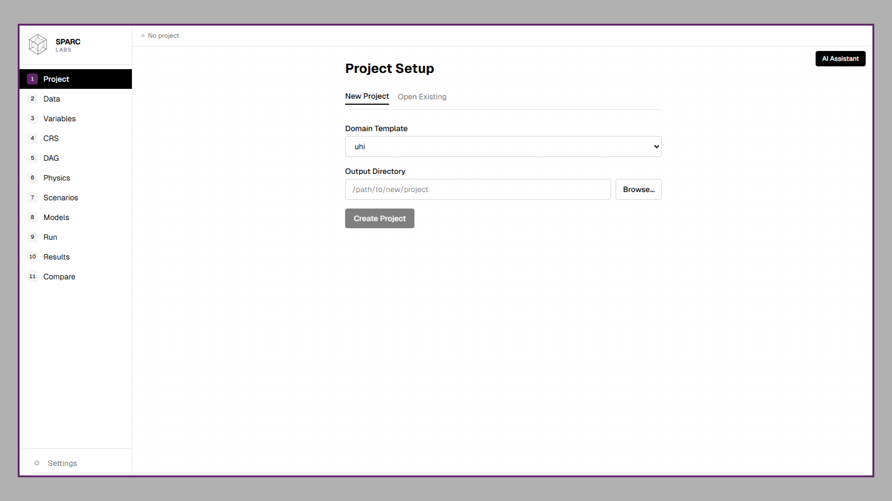
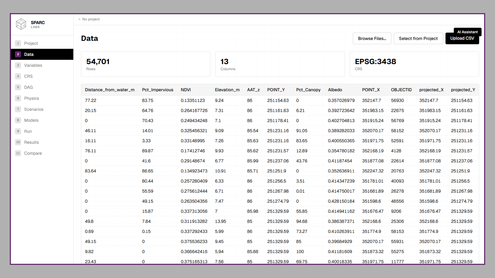
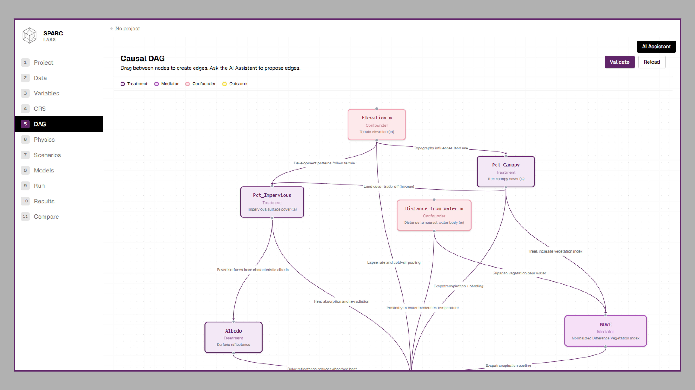

# SPARC — Spatial Analysis and Research Core

**SPARC Labs LLC**

[](https://www.python.org/downloads/)
[](https://doi.org/10.1016/j.uclim.2025.102671)
[](LICENSE)
[](#installation)
[](mailto:sparcurbanlabs@gmail.com)

**SPARC turns environmental and infrastructure data into causal, uncertainty-quantified intervention scenarios — powered by physics-constrained spatial machine learning.**

Published in [*Urban Climate* (2025)](https://doi.org/10.1016/j.uclim.2025.102671), SPARC has demonstrated **91.5% R²** on urban heat island prediction in Providence, RI, and has been applied to **ForceSMIP climate forcing attribution** at global scale. The pipeline trains geographically-weighted model ensembles, validates causal relationships via directed acyclic graphs (DAGs), and simulates "what-if" scenarios with built-in uncertainty quantification — all from a single `project.yml` configuration file across **13 domain templates**.

> **Get started:** [Watch the demo](#see-sparc-in-action) · [Try it locally](#quick-start) · [Download the desktop app](#desktop-app) · Interested in piloting? [Contact us](mailto:sparcurbanlabs@gmail.com)

---

## Table of Contents

- [See SPARC in Action](#see-sparc-in-action)
- [Pipeline Architecture](#pipeline-architecture)
- [Supported Domains](#supported-domains)
- [Installation](#installation)
- [Quick Start](#quick-start)
- [Desktop App](#desktop-app)
- [Results: Urban Heat Island (Brown UHI)](#results-urban-heat-island-brown-uhi)
- [Results: ForceSMIP Climate Forcing Attribution](#results-forcesmip-climate-forcing-attribution)
- [Interpreting Results](#interpreting-results)
- [Limitations & Assumptions](#limitations--assumptions)
- [Roadmap](#roadmap)
- [Project Structure](#project-structure)
- [Configuration Reference](#configuration-reference)
- [Dependencies](#dependencies)
- [License](#license)

---

## See SPARC in Action

<!-- VIDEO: Replace this comment with your screen recording embed (1–2 minutes).
     Example: [](https://your-video-url-here)
     Suggested text: "Watch how SPARC runs a neighborhood heat scenario with interventions and uncertainty" -->

**🎬 Video coming soon** — Watch how SPARC runs a neighborhood heat scenario with interventions and uncertainty.

### Screenshots

| | |
|:---:|:---:|
|  |  |
| *Project setup and template selection* | *Data upload and preview* |
|  |  |
| *Visual causal DAG editor* | *Physics constraints and priors* |
|  |  |
| *Pipeline execution with live progress* | *Spatial results and model diagnostics* |
|  |  |
| *Intervention scenario comparison* | *Monte Carlo uncertainty bands* |

> **Note:** Add your own screenshots to `docs/screenshots/` using the filenames above.

---

## Pipeline Architecture

SPARC executes five stages in sequence. Each stage reads from the previous stage's output, producing a fully traceable chain from raw data to policy-relevant scenario maps.

```
Stage 0   Correlogram Analysis            Moran's I at multiple lags → auto-detect bandwidth & block size
     │
Stage 1   GWEN Variable Selection         Geographically-weighted elastic net ranks predictors (optional)
     │
Stage 2   Spatial Cross-Validation        Train & evaluate four base models + meta-ensemble
     │
Stage 3   Causal Validation               Estimate causal effects via a DAG with refutation tests
     │
Stage 4   Scenario Simulation             Physics-constrained "what-if" predictions with uncertainty
```

### Stage 0 — Correlogram Analysis

Computes Moran's I at multiple distance lags to quantify spatial autocorrelation. Automatically selects optimal bandwidth for GWR/GWRF and block size for spatial cross-validation. Pipeline configuration (bandwidths, block sizes, kernel selection) is auto-wired from the correlogram results.

### Stage 1 — GWEN Variable Selection *(optional)*

A geographically-weighted elastic net (GWEN) ranks predictor importance across space. Uses correlogram-derived bandwidths for spatially-aware feature selection. A human checkpoint allows review before proceeding.

### Stage 2 — Spatial Cross-Validation & Model Training

Trains four base models on spatially-buffered folds to prevent spatial leakage:

| Model | Type | Description |
|-------|------|-------------|
| **OLS** | Global linear | Simple baseline with optional Laplacian eigenmaps |
| **GWR** | Local linear | Geographically weighted regression — spatially varying coefficients |
| **GWRF** | Local non-linear | Geographically weighted random forest |
| **GGPGAM** | Semi-parametric | Geographically guided generalized additive model |

A **LightGBM meta-ensemble** stacks base model predictions with monotonic constraints from the physics configuration and is tuned via Optuna. Laplacian eigenmaps can be included as spatial features.

### Stage 3 — Causal Validation

Uses a user-defined DAG to estimate structural causal coefficients (via DML, HGB, or OLS), blends them with literature priors through shrinkage, and runs DoWhy refutation tests (placebo, random common cause, subset, unobserved confounding). Optionally estimates heterogeneous treatment effects (CATE) via EconML's CausalForestDML.

### Stage 4 — Scenario Simulation

Predicts outcomes under user-defined interventions in three complementary modes:

| Mode | Method | What It Captures |
|------|--------|------------------|
| **Mode 1** | Ensemble re-prediction | Full non-linear interactions, model agreement |
| **Mode 2** | DAG coefficients × local MGWR weights | Spatial heterogeneity, causal mediation |
| **Mode 3** | Monte Carlo uncertainty propagation | Credible intervals (5th / 50th / 95th) |

Physics guardrails are applied automatically: variable bounds, diminishing returns (√ taper), sign enforcement, delta caps, extrapolation guards (Mahalanobis distance), and combined constraints (e.g., Canopy + Impervious ≤ 100%).

---

## Supported Domains

SPARC ships with **13 domain templates**, each containing a pre-configured `project.yml`, physics priors, constraint caps, and a causal DAG:

| Template | Domain | Description |
|----------|--------|-------------|
| `uhi` | Urban Heat Island | Ambient air temperature vs. land-cover variables |
| `forcesmip` | Climate Forcing | GCM forced-response attribution (ForceSMIP Tier 1) |
| `groundwater` | Hydrogeology | Groundwater level / contaminant modeling |
| `air_quality` | Air Quality | Pollutant concentration spatial analysis |
| `water_quality` | Water Quality | Surface water quality indicators |
| `stormwater` | Stormwater | Runoff and stormwater management |
| `coastal` | Coastal Engineering | Coastal erosion, sea-level response |
| `geotechnical` | Geotechnical | Soil properties and ground deformation |
| `seismic` | Seismic Hazard | Ground motion and seismic response |
| `noise` | Noise / Acoustics | Environmental noise modeling |
| `drought` | Drought | Drought index and vegetation stress |
| `wildfire` | Wildfire | Fire risk and burn severity |
| `blank` | Custom | Empty skeleton — bring your own domain config |

Create a new project from any template:

```powershell
sparc init --template uhi --output ./my_project
```

---

## Installation

**Requirements:** Python 3.10+

### Windows (Easiest)

```powershell
git clone https://github.com/SPARC-Labs-LLC/SPARC_Labs_GW3C.git
cd SPARC_Labs_GW3C
scripts\Install_SPARC.bat
```

The install script creates a virtual environment, installs all dependencies, and sets up the `sparc` CLI. Once complete:

```powershell
scripts\Start_SPARC.bat          # Launch the Streamlit UI
```

### Mac / Linux

```bash
git clone https://github.com/SPARC-Labs-LLC/SPARC_Labs_GW3C.git
cd SPARC_Labs_GW3C
python -m venv .venv
source .venv/bin/activate
pip install -e ".[ui]"
```

### Verify

```powershell
sparc --help
```

---

## Quick Start

### Option A: Streamlit UI (Recommended for New Users)

```powershell
# Windows
scripts\Start_SPARC.bat

# Mac/Linux
streamlit run run_ui.py
```

The UI walks you through template selection, data upload, variable configuration, DAG editing, and pipeline execution — all from your browser.

### Option B: CLI

```powershell
# 1. Scaffold from a template
sparc init --template uhi --output ./my_project

# 2. Edit project.yml (data path, CRS, predictors)
notepad ./my_project/project.yml

# 3. Validate
sparc validate --project ./my_project/project.yml

# 4. Run the full pipeline
sparc run --project ./my_project/project.yml --stage all
```

Or run stage-by-stage:

```powershell
sparc run -p project.yml -s 0      # Correlogram analysis
sparc run -p project.yml -s 1      # GWEN variable selection (optional)
sparc run -p project.yml -s 2      # Model training
sparc run -p project.yml -s 3      # Causal validation
sparc run -p project.yml -s 4      # Scenario simulation
```

---

## Desktop App

SPARC ships as a **native desktop application** built with Tauri v2 and React — no browser or cloud required. Your data stays on your machine.

**Status:** Fully functional core pipeline. Currently polishing additional features including Claude-assisted project setup, a visual DAG editor, and GPU-accelerated spatial maps via deck.gl.

**Interested in piloting?** Contact [sparcurbanlabs@gmail.com](mailto:sparcurbanlabs@gmail.com) for early access.

<!-- DESKTOP SCREENSHOTS: Add 2–3 screenshots of the desktop app to docs/screenshots/ -->
<!--  -->
<!--  -->

**Key features:**
- Runs entirely offline — no cloud, no API keys required for the core pipeline
- Native performance via Tauri v2 (lightweight ~15 MB, not Electron)
- Claude-powered guided project setup (optional, bring your own API key)
- Interactive spatial visualization with deck.gl and MapLibre GL
- Visual drag-and-drop DAG editor

---

## Results: Urban Heat Island (Brown UHI)

**Study area:** Brown University campus and surrounding Providence, RI neighborhoods
**Target variable:** Ambient Air Temperature z-score (AAT_z, °F)
**Observations:** 54,701 spatial points at ~30 m resolution
**CRS:** EPSG:3438 (RI State Plane) → EPSG:26919 (UTM 19N)
**Predictors:** Pct_Canopy, Pct_Impervious, NDVI, Albedo, Elevation_m, Distance_from_water_m

### Stage 2 — Model Performance (Out-of-Fold R²)

| Model | R² | RMSE |
|-------|-----|------|
| OLS | 0.294 | 1.437 |
| GWR | 0.828 | 0.709 |
| GWRF | 0.898 | 0.547 |
| GGPGAM | 0.839 | 0.686 |
| Meta-ensemble (standard) | 0.902 | 0.535 |
| **Meta-ensemble (enhanced, with Laplacian)** | **0.915** | **0.500** |

The enhanced meta-ensemble with 150 Laplacian eigenmaps achieved the best performance, explaining **91.5% of spatial temperature variance** with an RMSE of 0.50 z-score units. The Laplacian features provided a +1.2 pp R² uplift over the standard meta-ensemble.

### Stage 3 — Causal Validation

**Estimator:** Double Machine Learning (DML) with 5-fold cross-fitting
**DAG:** 3 treatments (Canopy, Impervious, Albedo) → 1 mediator (NDVI) → 1 outcome (AAT_z), with 2 confounders (Elevation, Distance from water)

#### Structural Coefficients

| Edge | Coefficient | Interpretation |
|------|-------------|----------------|
| Pct_Canopy → AAT_z | −0.022 | Each 1 pp canopy increase cools by 0.022 z-units |
| Pct_Impervious → AAT_z | +0.022 | Each 1 pp impervious increase warms by 0.022 z-units |
| NDVI → AAT_z | −4.131 | Strong cooling via vegetation pathway |
| Albedo → AAT_z | −2.759 | Strong cooling via surface reflectance |
| Pct_Canopy → NDVI | +0.003 | Trees increase vegetation index |
| Pct_Canopy → Pct_Impervious | −0.630 | Land-cover trade-off |

#### Causal Effect Estimates (DML backdoor)

| Treatment | ATE (backdoor) | CATE Mean ± Std | Bootstrap 95% CI | E-value |
|-----------|----------------|-----------------|-------------------|---------|
| Pct_Canopy | −0.015 | −0.019 ± 0.005 | [−0.019, −0.018] | 2.08 |
| Pct_Impervious | +0.018 | +0.018 ± 0.002 | [+0.020, +0.021] | 2.47 |
| Albedo | −2.780 | −2.676 ± 0.761 | [−3.223, −2.689] | 1.43 |

**Relative importance:** Impervious (51.1%) > Canopy (37.9%) > Albedo (11.0%)

All three treatments passed all four refutation tests (placebo, random common cause, subset, unobserved confounding). Causal discovery (PC-stable, LiNGAM, GES) achieved an edge F1 of 0.71 against the expert DAG.

### Stage 4 — Scenario Simulation (Selected Results)

Results from Mode 2 (DAG + MGWR coefficients), averaged across all 54,701 points:

#### Canopy Increase Scenarios

| Canopy Increase | Avg. Actual Change (pp) | Mean Cooling (z-units) | Std |
|----------------|------------------------|----------------------|-----|
| +5 pp | +4.8 | −0.130 | 0.078 |
| +10 pp | +9.6 | −0.258 | 0.154 |
| +15 pp | +14.3 | −0.437 | 0.251 |
| +20 pp | +18.9 | −0.509 | 0.288 |
| +30 pp | +27.9 | −0.608 | 0.341 |
| +50 pp | +44.6 | −0.738 | 0.408 |

Diminishing returns are visible beyond ~15 pp, where the √ taper begins to limit further cooling gains.

#### Impervious Decrease Scenarios

| Impervious Decrease | Avg. Actual Change (pp) | Mean Cooling (z-units) | Std |
|--------------------|------------------------|----------------------|-----|
| −5 pp | −4.5 | −0.098 | 0.073 |
| −10 pp | −8.9 | −0.195 | 0.145 |
| −20 pp | −17.6 | −0.383 | 0.282 |
| −30 pp | −25.9 | −0.456 | 0.329 |
| −50 pp | −41.0 | −0.550 | 0.390 |

#### Albedo Increase Scenarios

| Albedo Increase | Avg. Actual Change | Mean Cooling (z-units) | Std |
|----------------|-------------------|----------------------|-----|
| +0.05 | +0.050 | −0.098 | 0.142 |
| +0.10 | +0.099 | −0.196 | 0.283 |
| +0.20 | +0.197 | −0.384 | 0.528 |
| +0.30 | +0.285 | −0.450 | 0.606 |

#### Monte Carlo Uncertainty (10 draws, selected scenarios)

| Scenario | MC Mean | MC 5th %ile | MC 95th %ile |
|----------|---------|-------------|--------------|
| Canopy +10 pp | −0.009 | −0.010 | −0.009 |
| Canopy +30 pp | −0.017 | −0.018 | −0.017 |
| Impervious −20 pp | −0.025 | −0.029 | −0.023 |
| Albedo +0.10 | −0.097 | −0.104 | −0.091 |

---

## Results: ForceSMIP Climate Forcing Attribution

**Domain:** Forced Component Estimation from GCM Ensemble Members (ForceSMIP Tier 1)
**Target variable:** Sea-surface temperature trend (tos_trend, °C per 42-year trend)
**Approach:** Fingerprinting — cross-sectional trend fields treated as spatial data
**Observations:** 71,498 grid cells (2.5° global grid)
**CRS:** EPSG:4326 → EPSG:6933 (NSIDC EASE-Grid 2.0, equal-area)
**Predictors:** GMST_trend, GHG/aerosol/volcanic/solar forcing indices, ENSO, AMV, IPO, lat_abs, land_fraction, ocean_basin

> **Status:** The pooled SST (tos) variable has been run through all four stages. TAS (surface air temperature) completed through Stage 1. PR (precipitation) and PSL (sea-level pressure) have been initialized with GWEN only.

### Stage 2 — Model Performance (tos_trend, pooled members)

| Model | R² | RMSE |
|-------|-----|------|
| OLS | 0.152 | 0.634 |
| GWR | 0.529 | 0.472 |
| **GWRF** | **0.642** | **0.412** |
| GGPGAM | 0.500 | 0.487 |
| Meta-ensemble (standard) | 0.640 | 0.413 |
| Final ensemble | 0.640 | 0.413 |

The GWRF model was the best-performing individual model at R² = 0.642. The meta-ensemble matched but did not improve upon GWRF, likely because the global climate trend fields have less local-scale heterogeneity than the urban heat data.

### Stage 3 — Causal Validation

**Estimator:** DML
**DAG:** Treatments (GMST_trend, AMV_index, IPO_index) → Outcome (tos_trend), with confounders (member_id, lat_abs, land_fraction, ocean_basin)

#### Key Structural Coefficients

| Edge | Coefficient | Interpretation |
|------|-------------|----------------|
| GMST_trend → tos_trend | +1.444 | 1°C global warming → +1.44°C local SST trend (amplification) |
| AMV_index → tos_trend | +5.906 | Strong Atlantic variability imprint on SST |
| IPO_index → tos_trend | +1.246 | Pacific decadal variability imprint |
| AMV_index → GMST_trend | +8.006 | AMV projects onto global mean temperature |

**Relative importance:** GMST_trend (65.3%) > IPO_index (17.7%) > AMV_index (17.0%)

GMST_trend passed all four refutation tests (E-value = 2.03). AMV and IPO had weaker robustness (E-values of 1.58 and 1.30, respectively), consistent with their partly-internal, partly-forced nature.

### Stage 4 — Scenario Simulation (tos_trend)

Simulated forced-response patterns under incremental global warming:

| GMST Increment | N Cells | Mean Δ SST (°C) | Std | DAG Global Δ | Coeff Source |
|---------------|---------|-----------------|-----|-------------|--------------|
| +0.5 °C | 71,498 | +0.711 | 0.538 | +0.722 | mgwr_causal_anchored |
| +1.0 °C | 71,498 | +1.353 | 0.885 | +1.444 | mgwr_causal_anchored |
| +1.5 °C | 71,498 | +1.961 | 1.085 | +2.166 | mgwr_causal_anchored |

Internal variability scenarios (AMV, IPO) were also simulated, with AMV showing stronger spatial heterogeneity (std = 0.50 at +0.05 increment) driven by North Atlantic regional patterns.

### Comparison: UHI vs. ForceSMIP

| Dimension | Urban Heat Island | ForceSMIP (tos) |
|-----------|-------------------|-----------------|
| **Scale** | City (~30 m) | Global (2.5° grid) |
| **Best R²** | 0.915 (meta-ensemble) | 0.642 (GWRF) |
| **Primary drivers** | Impervious (51%), Canopy (38%) | GMST (65%), IPO (18%) |
| **Physics integration** | Literature priors from UHI meta-analyses | CMIP6 forcing indices |
| **Causal estimator** | DML (doubly-robust) | DML (doubly-robust) |
| **Refutation tests** | All pass | GMST passes; modes partially |
| **Scenarios** | Policy levers (plant trees, increase albedo) | Forcing increments (GHG warming) |
| **Key result** | +10 pp canopy → −0.26 z cooling | +1°C GMST → +1.35°C local SST |

---

## Interpreting Results

SPARC produces a rich set of outputs across its five stages. Here is a quick reference for the most important metrics:

| Metric | What It Means | Good Values |
|--------|---------------|-------------|
| **R² (out-of-fold)** | Fraction of spatial variance explained by the model | > 0.7 for most domains; > 0.9 is excellent |
| **RMSE** | Average prediction error in the target's units | Lower is better; compare across models |
| **E-value** | How strong an unmeasured confounder would need to be to nullify a causal estimate | > 1.5 suggests moderate robustness; > 2.0 is strong |
| **Refutation tests** | Placebo, random confounder, subset, and unobserved confounding checks | All four should pass (p > 0.05 or estimate ≈ 0 for placebo) |
| **MC percentiles (5th / 50th / 95th)** | Credible interval from Monte Carlo uncertainty propagation | Narrow bands = high confidence; wide bands = interpret cautiously |
| **Mode 1** | Ensemble re-prediction under modified inputs | Captures full non-linear model interactions |
| **Mode 2** | DAG coefficients × local MGWR weights | Captures spatial heterogeneity and causal mediation |
| **Mode 3** | Monte Carlo draws over coefficient uncertainty | Produces credible intervals, not point estimates |

### Quick checklist for reading scenario tables

1. **Check the "Avg. Actual Change" column** — did the physics constraints cap the intervention? If actual < requested, bounds were hit.
2. **Compare Mode 1 vs. Mode 2** — large disagreement may indicate non-linear effects the DAG doesn't capture.
3. **Look at the Std column** — high standard deviation means the effect varies significantly across space (spatial heterogeneity).
4. **Review MC percentiles** — if the 5th and 95th percentiles have the same sign, the direction of effect is robust.
5. **Check diminishing returns** — for large interventions (e.g., +50 pp canopy), the √ taper compresses gains. This is by design.

For a comprehensive plain-language guide, see [`docs/INTERPRETATION_GUIDE.md`](docs/INTERPRETATION_GUIDE.md).

---

## Limitations & Assumptions

Transparency builds trust. Here is what SPARC does well, where it has boundaries, and what to keep in mind when interpreting results.

| Area | What to Know |
|------|-------------|
| **Observational data** | SPARC works with observational (non-experimental) data. Causal estimates depend on the correctness of the user-defined DAG and the assumption that there are no unmeasured confounders. E-values quantify how strong a hidden confounder would need to be to overturn a finding, but they are sensitivity bounds — not proof of causation. |
| **Spatial stationarity** | Geographically-weighted models assume that spatial relationships are locally smooth. Abrupt regime changes (e.g., a coastline, a policy boundary) may violate this assumption. |
| **Physics constraints are user-specified** | Monotone signs, variable caps, priors, and diminishing-return tapers reflect domain knowledge encoded by the analyst. They improve plausibility but are not ground truth — review them critically for each application. |
| **Extrapolation** | Scenarios that push variables beyond the training data range trigger extrapolation guards (Mahalanobis distance), but out-of-distribution predictions should always be interpreted cautiously. |
| **Uncertainty quantification** | Monte Carlo draws are parametric (sampled over estimated coefficient distributions). True epistemic uncertainty — from model mis-specification or missing variables — may be wider than reported intervals. |
| **Resolution sensitivity** | Performance varies with data density and resolution. The Providence UHI study (30 m, R² = 0.915) benefited from dense local data; coarser grids like ForceSMIP (2.5°, R² = 0.642) naturally yield lower explanatory power. |
| **Cross-sectional design** | The current pipeline models spatial variation at a single time slice. Longitudinal causal claims (e.g., "planting trees *will* cool a neighborhood over 10 years") require temporal extensions not yet implemented. |
| **Causal discovery** | Automated structure learning (PC-stable, LiNGAM, GES) is provided as a diagnostic, not a replacement for expert DAG specification. Edge F1 against expert graphs is typically 0.6–0.8. |

We actively work to reduce these limitations in each release. If you encounter an edge case or have domain-specific feedback, please [open an issue](https://github.com/SPARC-Labs-LLC/SPARC_Labs_GW3C/issues) or contact [sparcurbanlabs@gmail.com](mailto:sparcurbanlabs@gmail.com).

---

## Roadmap

SPARC is under active development. Key directions on the horizon:

| Initiative | Description |
|-----------|-------------|
| **GCM Downscaling & Climate Emulation** | Statistical and hybrid downscaling of global climate model outputs to local scales, enabling rapid scenario evaluation without full GCM runs. |
| **Domain Expansion** | Additional environmental and infrastructure templates — extending beyond the current 13 domains into new areas such as environmental remediation, transportation resilience, and public health. |
| **Planetary Expansion** | Extraterrestrial applications including optimal lunar roadway mapping and surface characterization for off-Earth infrastructure planning. |
| **Hybrid Physics Integration** | Tighter coupling between numerical physics models and the ML pipeline — using physics simulators as priors, constraints, or co-training signals rather than post-hoc guardrails. |

Have ideas or want to collaborate? Reach out at [sparcurbanlabs@gmail.com](mailto:sparcurbanlabs@gmail.com).

---

## Project Structure

```
GW3C_v2.1/
├── sparc/                   # Main package
│   ├── __main__.py          # CLI entry point (sparc init / validate / run / scenario / report)
│   ├── config/              # Configuration loader, JSON schema validation
│   ├── data/                # Data utilities, temporal helpers
│   ├── models/              # OLS, GWR, GWRF, GGPGAM, Deep Kriging, Meta-ensemble, GWEN
│   ├── features/            # Laplacian eigenmaps, fold-aware spatial features
│   ├── causal/              # DAG definition, DoWhy integration, CATE, counterfactuals
│   ├── evaluation/          # Model evaluation metrics and diagnostics
│   ├── interventions/       # Scenario simulator, physics priors, extrapolation guards
│   ├── run/                 # Pipeline orchestration (per-stage executors)
│   └── ui/                  # Streamlit interactive UI
├── templates/               # Domain templates (13 domains)
├── examples/                # Example projects (Brown UHI)
├── tests/                   # Smoke tests
├── docs/                    # MANUAL, PIPELINE_GUIDE, CONTRIBUTING
├── scripts/                 # Helper scripts (Start_SPARC.bat)
├── run_ui.py                # Launch Streamlit UI
├── pyproject.toml           # Package metadata and dependencies
├── README.md
├── LICENSE
└── CITATION.cff
```

---

## Configuration Reference

Every project is driven by a single `project.yml` file with these sections:

| Section | Required | Description |
|---------|----------|-------------|
| `project` | Yes | Name, domain, version, response units |
| `data` | Yes | CSV path, target column, ID column, coordinates |
| `crs` | Yes | Input and projected EPSG codes |
| `predictors` | Yes | List of feature column names |
| `physics` | No | Priors file, caps file, monotone constraints |
| `causal` | No | DAG file, estimator (ols/hgb/dml), actionable/fixed vars |
| `output` | No | Output directory structure |
| `pipeline` | No | Random seed, n_folds, fast_mode, MC settings |
| `flags` | No | Feature flags (GWEN, GWRF, Laplacian) |
| `models` | No | Per-model hyperparameters |
| `scenarios` | No | Single-variable intervention definitions |
| `joint_scenarios` | No | Multi-variable intervention definitions |

See [`docs/MANUAL.md`](docs/MANUAL.md) for the full configuration reference and [`docs/PIPELINE_GUIDE.md`](docs/PIPELINE_GUIDE.md) for a step-by-step walkthrough.

---

## Dependencies

| Category | Packages |
|----------|----------|
| Scientific | numpy, pandas, scipy, scikit-learn |
| Spatial | geopandas, libpysal, esda, mgwr, pyproj |
| Modeling | lightgbm, optuna, pygam, torch |
| Causal | dowhy, networkx, econml |
| Utilities | matplotlib, seaborn, joblib, pyyaml, jsonschema |

---

## License

Proprietary — SPARC Labs LLC.
