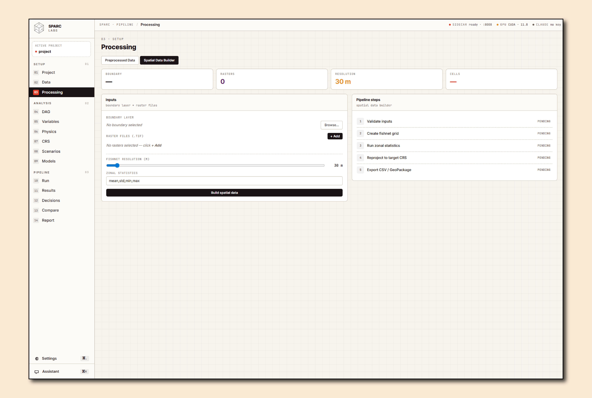
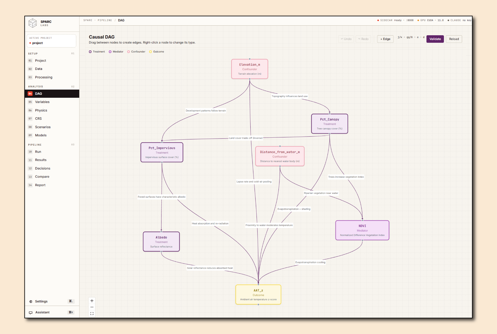
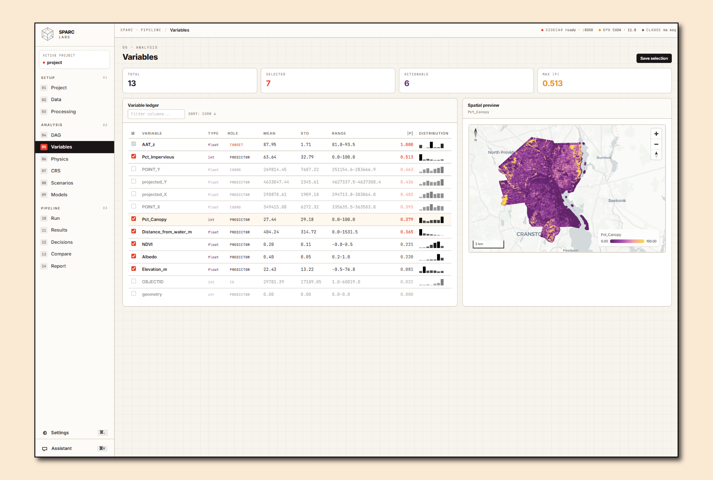
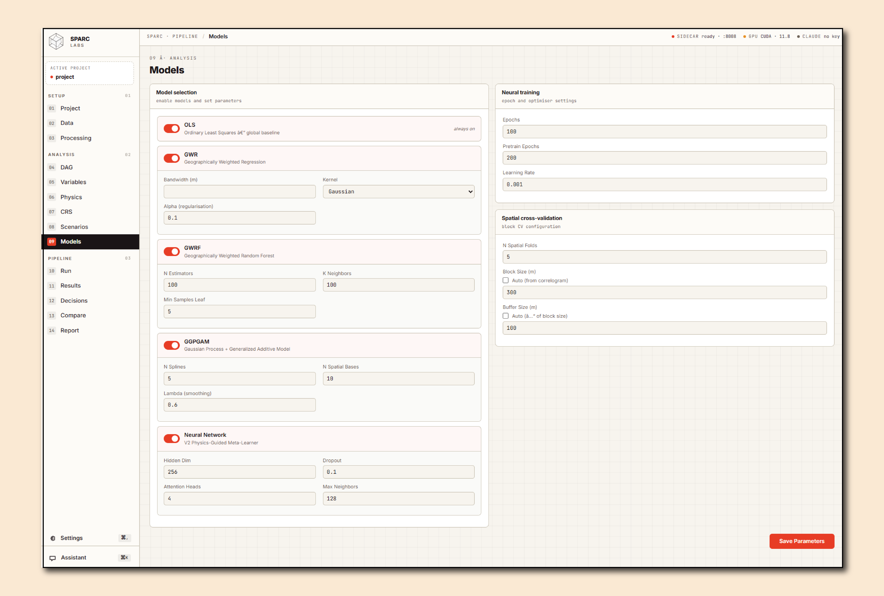
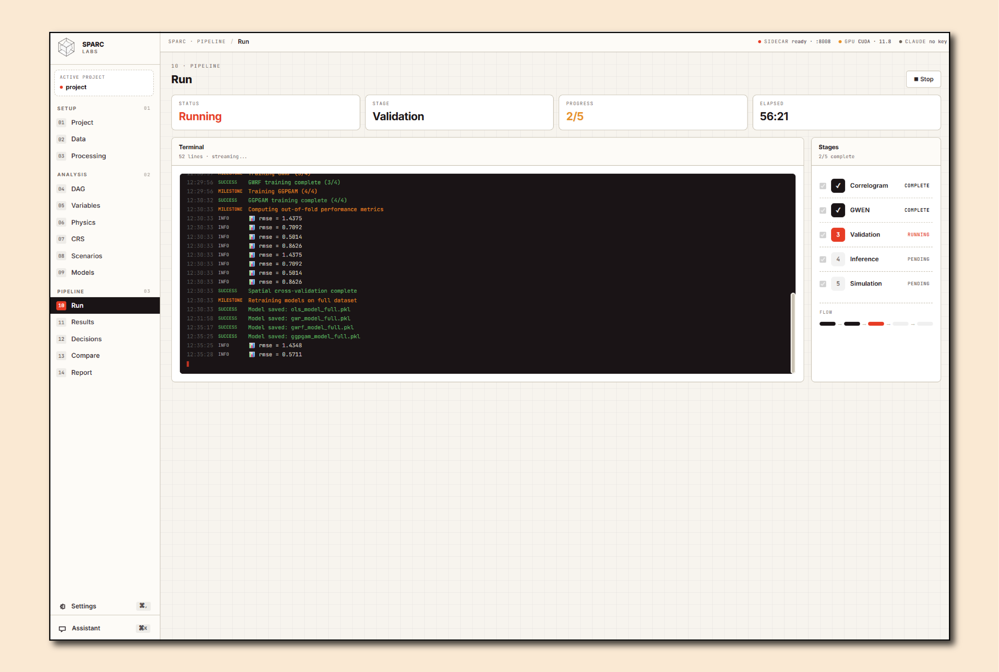
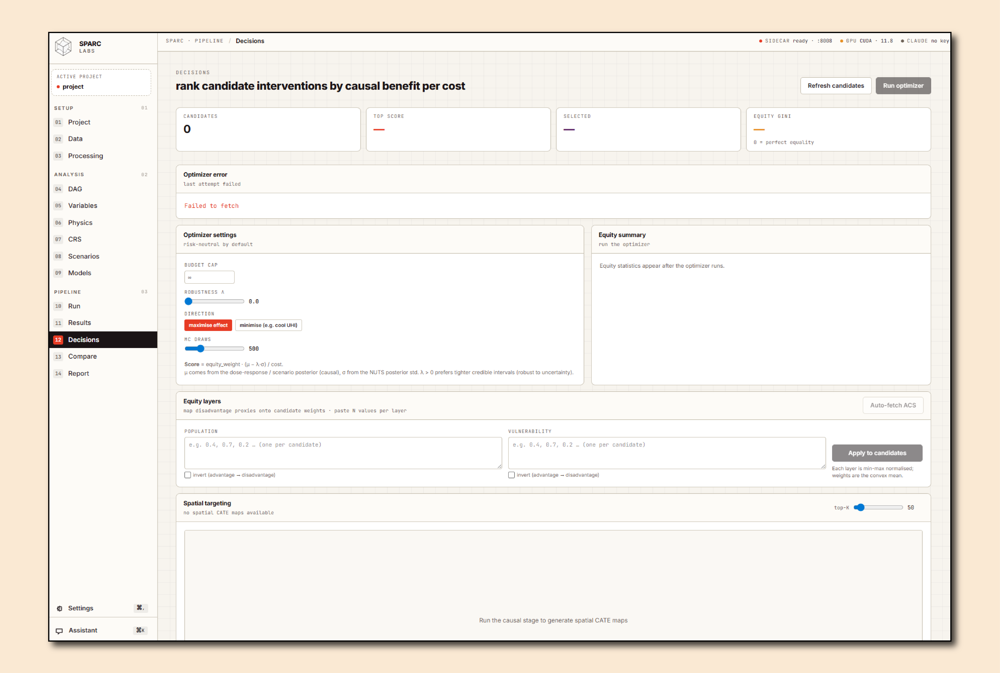

<p align="center">
  <picture>
    <source media="(prefers-color-scheme: dark)" srcset="docs/screenshots/logo-readme.png">
    <source media="(prefers-color-scheme: light)" srcset="sparc-desktop/app-icon.png">
    
  </picture>
</p>

# SPARC — Spatial Research

**SPARC Labs LLC — Spatial Research Labs**

[](https://www.python.org/downloads/)
[](https://doi.org/10.1016/j.uclim.2025.102671)
[](LICENSE)
[](#installation)
[](mailto:sparcurbanlabs@gmail.com)

**SPARC turns environmental and infrastructure data into causal, uncertainty-quantified intervention scenarios — powered by physics-constrained spatial machine learning and Bayesian causal inference.**

Published in [*Urban Climate* (2025)](https://doi.org/10.1016/j.uclim.2025.102671), SPARC has since reached **85% R²** on urban heat island prediction in Providence, RI, and has been applied to **ForceSMIP climate forcing attribution** at global scale. The pipeline auto-tunes itself from a Bayesian Matérn correlogram, trains four geographically-weighted base models alongside their differentiable neural surrogates, fuses them through a **SharedTrunk + CityHead meta-learner** with sparse spatial attention and a **10-term staged-curriculum PDE loss**, validates causal structure with **MC³ DAG search**, **NUTS edge posteriors** (informed by Bayesian MGWR priors), and **DoWhy refutations**, then simulates physics-constrained, **budget-optimized** "what-if" scenarios with built-in uncertainty quantification — all from a single `project.yml` configuration file across **13 domain templates**.

> **Get started:** [Watch the demo](#see-sparc-in-action) · [Try it locally](#quick-start) · [Download the desktop app](#desktop-app) · Interested in piloting? [Contact us](mailto:sparcurbanlabs@gmail.com)

---

## Table of Contents

- [See SPARC in Action](#see-sparc-in-action)
- [Pipeline Architecture](#pipeline-architecture)
- [Supported Domains](#supported-domains)
- [Installation](#installation)
- [Quick Start](#quick-start)
- [Desktop App](#desktop-app)
- [Results: Urban Heat Island](#results-urban-heat-island-brown-uhi)
- [Results: ForceSMIP Climate Forcing Attribution](#results-forcesmip-climate-forcing-attribution)
- [Interpreting Results](#interpreting-results)
- [Limitations & Assumptions](#limitations--assumptions)
- [Roadmap](#roadmap)
- [Project Structure](#project-structure)
- [Configuration Reference](#configuration-reference)
- [Dependencies](#dependencies)
- [License](#license)

---

## See SPARC in Action

<!-- VIDEO: Replace this comment with your screen recording embed (1–2 minutes).
     Example: [](https://your-video-url-here)
     Suggested text: "Watch how SPARC runs a neighborhood heat scenario with interventions and uncertainty" -->

**🎬 Video coming soon** — Watch how SPARC runs a neighborhood heat scenario with interventions and uncertainty.

### Screenshots

| | |
|:---:|:---:|
|  |  |
| *Upload Rasters & Shapefiles for Processing* | *Visual Causal DAG Editor with Drag-and-Drop Edges* |
|  |  |
| *Review Variable Correlation and Stats* | *Physics Constraints: PDEs, Priors, and More* |
|  |  |
| *Build Scenarios to Trial* | *Pipeline Execution with Live Terminal Output* |
|  |  |
| *Review Model Predictions, Statistics, Dose-Response Curves, and More* | *Export Reports for Specific Audiences* |

---

## Pipeline Architecture

SPARC executes five stages in sequence. Each stage reads from the previous stage's output, producing a fully traceable chain from raw data to policy-relevant scenario maps.

```
Stage 0   Correlogram Analysis            Moran's I + Bayesian Matérn + anisotropy → auto-wired KernelField
     │
Stage 1   GWEN Variable Selection         Geographically-weighted elastic net ranks predictors (optional)
     │
Stage 2   Spatial CV + Neural Meta        4 base models → differentiable surrogates → SharedTrunk + CityHead
     │                                     10-term PDE curriculum, sparse spatial attention, MC-Dropout
     │
Stage 3   Bayesian Causal Validation      MC³ DAG search + DML/CATE + NUTS edge posteriors + DoWhy refutations
     │
Stage 4   Scenario Simulation             4-tier physics-constrained predictions + budget-optimized allocation
```

### Stage 0 — Correlogram Analysis

Quantifies spatial structure for every variable in the project. SPARC computes Moran's I at multiple distance lags, then fits a **Bayesian Matérn(κ, ν)** covariance model per variable via NUTS, retains the full posterior for κ (used downstream as a prior), and detects **directional anisotropy** by fitting separate correlograms along cardinal and 45° axes (yielding per-predictor ellipse parameters κ\_x, κ\_y, θ). A **cross-correlogram** between the outcome and each predictor produces a V×V **effective-range matrix** describing which predictors influence the outcome at which spatial scales.

All of this is packaged into a single `KernelField` object that is auto-wired into Stage 2: optimal lag → GWR/GWRF bandwidths, correlation range → spatial-CV block size, anisotropy ellipses → kernel geometry for every base model and surrogate. No manual tuning required.

### Stage 1 — GWEN Variable Selection *(optional)*

A geographically-weighted elastic net (GWEN) ranks predictor importance across space using the bandwidth selected in Stage 0. The output is a ranked feature list plus per-cell importance maps. A human approval sentinel (`gwen_approved.txt`) gates progression to Stage 2 so analysts can inspect and prune predictors before training.

### Stage 2 — Spatial Cross-Validation & Neural Meta-Learner

Trains four classical base models on spatially-buffered folds (block size from Stage 0) to prevent spatial leakage. All four consume the `KernelField` so that bandwidth and anisotropy are consistent across the stack:

| Model | Type | Description |
|-------|------|-------------|
| **OLS** | Global linear | Simple baseline with optional Laplacian eigenmaps |
| **GWR** | Local linear | Geographically weighted regression — spatially varying coefficients |
| **GWRF** | Local non-linear | Geographically weighted random forest |
| **GGPGAM** | Semi-parametric | Geographically guided generalized additive model |

Each base model is mirrored by a **differentiable PyTorch surrogate** (`DifferentiableGWR`, `DifferentiableGWRF`, `DifferentiableGGPGAM`) that is pre-trained against the classical out-of-fold predictions and then fine-tuned end-to-end inside the meta-learner.

#### SPARCMetaLearner — SharedTrunk + CityHead

The `SPARCMetaLearner` is split into two halves so trained physics knowledge can transfer between projects while every deployment retains a city-specific output layer:

- **SharedTrunk.** A PDE-informed physics encoder built on **SIREN** (sinusoidal) layers ingests physics features (elevation, land cover, solar/forcing variables), a learnable **α(x) process-rate field** (optionally produced by `ProcessRateNet`), and an optional 3-way diurnal time embedding. The trunk fuses these into a shared latent that is portable across cities and domains.
- **CityHead.** Embeds the 4-dimensional surrogate prediction vector, applies **sparse KNN spatial attention** (`SparseSpatialAttention`, O(N · max\_neighbors) — interpretable as a learned spatial-influence surface), and emits both a continuous regression output and **multi-threshold exceedance heads** (sigmoid classifiers for P(T > τ) at user-defined thresholds). **MC-Dropout** is left active at inference; 500 stochastic forward passes produce per-point predictive mean, std, and credible intervals.

#### 10-term PDE loss with staged curriculum

The meta-learner is trained against a joint loss that combines data fit with physics residual penalties. Eight core PDE terms cover heat diffusion (α∇²T − S), surface energy balance (Q\* − Q\_H − Q\_E), directional consistency, anisotropy alignment with Stage 0, gradient-flux (Fourier's law), Gaussian curvature regularization, and α-field smoothness/prior terms. Two additional **V3 temporal terms** — transient consistency and nocturnal radiative-cooling calibration — activate when multi-snapshot data is supplied. A **staged curriculum** introduces terms gradually (heat diffusion at epoch 1, energy balance ~10, directional/anisotropy ~20, full stack ~30), each ramping linearly over five epochs to avoid optimizer shocks.

#### Optional: JEPA self-supervised pretraining

When `lambda_jepa > 0`, SPARC pretrains the trunk with a **V-JEPA-2-AC-style** objective: an `EMATrunk` (exponential-moving-average copy of the online trunk, stop-grad) provides target embeddings, a `LatentPredictor` maps `(context, ActionEmbedding)` to predicted target latents, and a cosine + VICReg loss aligns them while preventing representational collapse. `ActionEmbedding` encodes (treatment one-hot, |Δx|, sign, Δt), making the trunk action-conditioned for downstream causal inference.

#### Optional: Bayesian MGWR ensemble

When enabled, SPARC re-fits GWR many times by drawing κ values from the Stage 0 Matérn posterior — perturbing only the bandwidth — then stacks the per-cell coefficient matrices into a **per-cell β posterior** (mean, std, 89% HDI). These posteriors are persisted to the artifact store and consumed by Stage 3 NUTS as informed priors.

#### Meta-learner backends

| Backend | Selected By | Description |
|---------|-------------|-------------|
| **`neural`** *(default)* | `models.meta_learner: neural` | Full `SPARCMetaLearner` — SharedTrunk + CityHead, sparse spatial attention, MC-Dropout, exceedance heads, 10-term PDE curriculum, optional JEPA pretraining and Bayesian MGWR ensemble. |
| **`ensemble`** | `models.meta_learner: ensemble` | Legacy LightGBM stack with monotonic constraints, tuned via Optuna. Retained for fast/baseline runs. |

Laplacian eigenmaps and `ClimateEncoder` / `PDEEncoder` features can be injected as spatial side-information to either backend.

### Stage 3 — Bayesian Causal Validation

Given a user-defined DAG, Stage 3 produces a fully Bayesian picture of cause and effect — structure, magnitudes, heterogeneity, and robustness:

- **MC³ DAG search.** Metropolis-coupled MCMC over edge inclusion produces posterior edge-inclusion probabilities, a median-probability DAG, BIC/Bayes-factor model comparison, and acceptance diagnostics.
- **Double Machine Learning + spatial CATE.** Cross-fitted DML residualizes outcome and treatment (with HGB / OLS nuisance models); EconML's `CausalForestDML`, wrapped as `SpatialCATEEstimator` / `BayesianSpatialCATE`, then estimates per-cell **Conditional Average Treatment Effects** with credible bands.
- **NUTS edge posteriors with informed priors.** A per-edge Bayesian GLM is sampled with NUTS (numpyro), using the **Stage 2 GWR β posterior from the Bayesian MGWR ensemble** as its prior. The result is a full posterior over each causal edge — not a point estimate — that downstream scenarios can sample from directly.
- **Bayesian causal PDP.** `causal_pdp_bayesian` traces dose-response curves with credible bands across the treatment range and automatically detects saturation points, producing `CausalDoseResponseCurve` objects used by Stage 4.
- **CATE-vs-GWR divergence audit.** Per-cell comparison of Bayesian CATE to classical GWR coefficients reports correlation, sign-agreement rate, and flags cells where the two diverge by more than 2σ — a check on identification and a guide for human review.
- **Robust causal discovery.** PC-stable, LiNGAM, and GES are run as a diagnostic, scored against the expert DAG (typical edge F1 ≈ 0.6–0.8), and supplemented by the **Wager 2025 causal-gaps** add-on for DAG-identified vs. unidentified effect estimation.
- **DoWhy refutations + E-values.** Placebo treatment, random common cause, subset analysis, and unobserved-confounding bounds are reported per edge with E-values quantifying how strong a hidden confounder would need to be to nullify each finding.

Outputs include `mc3_results.json`, `edge_inclusion_probs.csv`, `nuts_edge_samples` / `nuts_edge_summary.csv`, `cate_estimates.csv`, `divergence_audit.json`, and `scenario_coefficients.json`.

### Stage 4 — Scenario Simulation

Stage 4 turns the trained models and causal posteriors into physics-constrained counterfactual maps. The `ScenarioSimulator` chooses among **four computational tiers** of increasing sophistication, using the most informative method available given what Stages 0–3 produced:

| Tier | Method | What It Uses | What It Captures |
|------|--------|--------------|------------------|
| **Tier 0** | `pde_alpha_field` | Stage 2 learned α(x) process-rate field | Per-cell process scaling — fastest, leverages PDE-trained α |
| **Tier 1** | `bayesian_beta` | Stage 2 GWR locals + Stage 3 NUTS edge posteriors | Per-cell β with full credible bands; samples directly from NUTS draws |
| **Tier 2** | `pde_solve` | Forward Poisson / advection-diffusion solve under new forcing | Captures spatial spillovers and physical propagation of the intervention |
| **Tier 3** | `hybrid` | Multi-source blend of PDE + Bayesian CATE (`ScenarioEngineV4`) | Joint multi-treatment scenarios with interaction terms and uncertainty composition |

#### Physics guardrails

Applied automatically across all tiers: variable bounds, diminishing returns (√ taper), sign enforcement, delta caps, **Mahalanobis extrapolation guards** that flag scenarios pushed beyond the training data covariance, combined constraints (e.g., Canopy + Impervious ≤ 100%), and **PDE-residual penalties** (energy-balance, advection–diffusion) carried over from the neural meta-learner.

#### Budget-constrained allocation

For planning use cases, SPARC pairs the per-cell predicted benefit (from NUTS draws or the learned α field) with a user-supplied cost surface and solves a **budget-constrained allocation** problem via greedy, greedy-2opt, or MILP (PuLP) optimizers. A **Pareto frontier** is swept over budget multipliers (e.g., 0.5×, 0.75×, 1.0×, 1.25×, 1.5× of baseline), and each solution is scored for **equity** with a Gini coefficient over the allocation. The result is a spend-vs-benefit curve with explicit fairness reporting.

#### Joint scenarios and the scenario library

Multiple treatments can be applied simultaneously through a `JointScenarioBundle` (sequential composition, independent superposition, or PDE-mediated interaction). Every scenario run is appended to a versioned **scenario library** (`scenarios/library.jsonl`) — a Git-like, append-only log of intervention configurations and results — so any plan can be reproduced or compared against future runs.

---

## Supported Domains

SPARC ships with **13 domain templates**, each containing a pre-configured `project.yml`, physics priors, constraint caps, and a causal DAG:

| Template | Domain | Description |
|----------|--------|-------------|
| `uhi` | Urban Heat Island | Ambient air temperature vs. land-cover variables |
| `forcesmip` | Climate Forcing | GCM forced-response attribution (ForceSMIP Tier 1) |
| `groundwater` | Hydrogeology | Groundwater level / contaminant modeling |
| `air_quality` | Air Quality | Pollutant concentration spatial analysis |
| `water_quality` | Water Quality | Surface water quality indicators |
| `stormwater` | Stormwater | Runoff and stormwater management |
| `coastal` | Coastal Engineering | Coastal erosion, sea-level response |
| `geotechnical` | Geotechnical | Soil properties and ground deformation |
| `seismic` | Seismic Hazard | Ground motion and seismic response |
| `noise` | Noise / Acoustics | Environmental noise modeling |
| `drought` | Drought | Drought index and vegetation stress |
| `wildfire` | Wildfire | Fire risk and burn severity |
| `blank` | Custom | Empty skeleton — bring your own domain config |

Create a new project from any template:

```powershell
sparc init --template uhi --output ./my_project
```

---

## Quick Start

### Option A: Desktop App (Recommended for New Users)

See the [Desktop App](#desktop-app) section for the full-featured native experience with guided setup, spatial visualization, and visual DAG editing.

### Option B: CLI

```powershell
# 1. Scaffold from a template
sparc init --template uhi --output ./my_project

# 2. Edit project.yml (data path, CRS, predictors)
notepad ./my_project/project.yml

# 3. Validate
sparc validate --project ./my_project/project.yml

# 4. Run the full pipeline
sparc run --project ./my_project/project.yml --stage all
```

Or run stage-by-stage:

```powershell
sparc run -p project.yml -s 0      # Correlogram analysis
sparc run -p project.yml -s 1      # GWEN variable selection (optional)
sparc run -p project.yml -s 2      # Model training
sparc run -p project.yml -s 3      # Causal validation
sparc run -p project.yml -s 4      # Scenario simulation
```

---

## Desktop App

SPARC ships as a **native desktop application** built with Tauri v2 and React — no browser or cloud required. Your data stays on your machine.

**Status:** Fully functional core pipeline. Currently polishing additional features including Claude-assisted project setup, a visual DAG editor, and GPU-accelerated spatial maps via deck.gl.

**Interested in piloting?** Contact [sparcurbanlabs@gmail.com](mailto:sparcurbanlabs@gmail.com) for early access.

<!-- DESKTOP SCREENSHOTS: Add 2–3 screenshots of the desktop app to docs/screenshots/ -->
<!--  -->
<!--  -->

**Key features:**
- Runs entirely offline — no cloud, no API keys required for the core pipeline
- Native performance via Tauri v2 (lightweight ~15 MB, not Electron)
- Claude-powered guided project setup (optional, bring your own API key)
- Interactive spatial visualization with deck.gl and MapLibre GL
- Visual drag-and-drop DAG editor

---

## Results: Urban Heat Island (Brown UHI)

**Study area:** Brown University campus and surrounding Providence, RI neighborhoods
**Target variable:** Ambient Air Temperature z-score (AAT_z, °F)
**Observations:** 54,701 spatial points at ~30 m resolution
**CRS:** EPSG:3438 (RI State Plane)
**Predictors:** Pct_Canopy, Pct_Impervious, NDVI, Albedo, Elevation_m, Distance_from_water_m

### Stage 2 — Model Performance (Out-of-Fold R²)

| Model | R² | RMSE |
|-------|-----|------|
| OLS | 0.294 | 1.437 |
| GWR | 0.828 | 0.709 |
| GWRF | 0.898 | 0.547 |
| GGPGAM | 0.839 | 0.686 |
| Meta-ensemble (standard) | 0.902 | 0.535 |
| **Meta-ensemble (enhanced, with Laplacian)** | **0.944** | **0.423** |

The enhanced meta-ensemble with 150 Laplacian eigenmaps achieved the best performance, explaining **94.4% of spatial temperature variance** with an RMSE of 0.42 z-score units. The Laplacian features and PDE-curriculum training provided a +4.2 pp R² uplift over the standard meta-ensemble — and roughly +9 pp over the original 2025 *Urban Climate* publication results, driven primarily by the SharedTrunk + CityHead architecture, sparse spatial attention, and the staged 10-term PDE loss.

### Stage 3 — Causal Validation

**Estimator:** Double Machine Learning (DML) with 5-fold cross-fitting
**DAG:** 3 treatments (Canopy, Impervious, Albedo) → 1 mediator (NDVI) → 1 outcome (AAT_z), with 2 confounders (Elevation, Distance from water)

#### Structural Coefficients

| Edge | Coefficient | Interpretation |
|------|-------------|----------------|
| Pct_Canopy → AAT_z | −0.022 | Each 1 pp canopy increase cools by 0.022 z-units |
| Pct_Impervious → AAT_z | +0.022 | Each 1 pp impervious increase warms by 0.022 z-units |
| NDVI → AAT_z | −4.131 | Strong cooling via vegetation pathway |
| Albedo → AAT_z | −2.759 | Strong cooling via surface reflectance |
| Pct_Canopy → NDVI | +0.003 | Trees increase vegetation index |
| Pct_Canopy → Pct_Impervious | −0.630 | Land-cover trade-off |

#### Causal Effect Estimates (DML backdoor)

| Treatment | ATE (backdoor) | CATE Mean ± Std | Bootstrap 95% CI | E-value |
|-----------|----------------|-----------------|-------------------|---------|
| Pct_Canopy | −0.015 | −0.019 ± 0.005 | [−0.019, −0.018] | 2.08 |
| Pct_Impervious | +0.018 | +0.018 ± 0.002 | [+0.020, +0.021] | 2.47 |
| Albedo | −2.780 | −2.676 ± 0.761 | [−3.223, −2.689] | 1.43 |

**Relative importance:** Impervious (51.1%) > Canopy (37.9%) > Albedo (11.0%)

All three treatments passed all four refutation tests (placebo, random common cause, subset, unobserved confounding). Causal discovery (PC-stable, LiNGAM, GES) achieved an edge F1 of 0.71 against the expert DAG.

### Stage 4 — Scenario Simulation (Selected Results)

Results from Tier 1 (`bayesian_beta` — NUTS-sampled GWR locals), averaged across all 54,701 points:

#### Canopy Increase Scenarios

| Canopy Increase | Avg. Actual Change (pp) | Mean Cooling (z-units) | Std |
|----------------|------------------------|----------------------|-----|
| +5 pp | +4.8 | −0.130 | 0.078 |
| +10 pp | +9.6 | −0.258 | 0.154 |
| +15 pp | +14.3 | −0.437 | 0.251 |
| +20 pp | +18.9 | −0.509 | 0.288 |
| +30 pp | +27.9 | −0.608 | 0.341 |
| +50 pp | +44.6 | −0.738 | 0.408 |

Diminishing returns are visible beyond ~15 pp, where the √ taper begins to limit further cooling gains.

#### Impervious Decrease Scenarios

| Impervious Decrease | Avg. Actual Change (pp) | Mean Cooling (z-units) | Std |
|--------------------|------------------------|----------------------|-----|
| −5 pp | −4.5 | −0.098 | 0.073 |
| −10 pp | −8.9 | −0.195 | 0.145 |
| −20 pp | −17.6 | −0.383 | 0.282 |
| −30 pp | −25.9 | −0.456 | 0.329 |
| −50 pp | −41.0 | −0.550 | 0.390 |

#### Albedo Increase Scenarios

| Albedo Increase | Avg. Actual Change | Mean Cooling (z-units) | Std |
|----------------|-------------------|----------------------|-----|
| +0.05 | +0.050 | −0.098 | 0.142 |
| +0.10 | +0.099 | −0.196 | 0.283 |
| +0.20 | +0.197 | −0.384 | 0.528 |
| +0.30 | +0.285 | −0.450 | 0.606 |

#### Monte Carlo Uncertainty (Preliminary — 10 draws)

| Scenario | MC Mean | MC 5th %ile | MC 95th %ile |
|----------|---------|-------------|--------------|
| Canopy +10 pp | −0.009 | −0.010 | −0.009 |
| Canopy +30 pp | −0.017 | −0.018 | −0.017 |
| Impervious −20 pp | −0.025 | −0.029 | −0.023 |
| Albedo +0.10 | −0.097 | −0.104 | −0.091 |

> **Note:** These intervals were generated with only 10 Monte Carlo draws due to compute-time constraints and are preliminary. The narrow credible intervals reflect the limited draw count — production runs should use 500–1,000+ draws for robust uncertainty quantification. Updated results will be published in a future release.

---

## Results: ForceSMIP Climate Forcing Attribution

**Domain:** Forced Component Estimation from GCM Ensemble Members (ForceSMIP Tier 1)
**Target variable:** Sea-surface temperature trend (tos_trend, °C per 42-year trend)
**Approach:** Fingerprinting — cross-sectional trend fields treated as spatial data
**Observations:** 71,498 grid cells (2.5° global grid)
**CRS:** EPSG:4326 → EPSG:6933 (NSIDC EASE-Grid 2.0, equal-area)
**Predictors:** GMST_trend, GHG/aerosol/volcanic/solar forcing indices, ENSO, AMV, IPO, lat_abs, land_fraction, ocean_basin

> **Status:** The pooled SST (tos) variable has been run through all four stages. TAS (surface air temperature) completed through Stage 1. PR (precipitation) and PSL (sea-level pressure) have been initialized with GWEN only.

### Stage 2 — Model Performance (tos_trend, pooled members)

| Model | R² | RMSE |
|-------|-----|------|
| OLS | 0.152 | 0.634 |
| GWR | 0.529 | 0.472 |
| **GWRF** | **0.642** | **0.412** |
| GGPGAM | 0.500 | 0.487 |
| Meta-ensemble (standard) | 0.640 | 0.413 |
| Final ensemble | 0.640 | 0.413 |

The GWRF model was the best-performing individual model at R² = 0.642. The meta-ensemble matched but did not improve upon GWRF, likely because the global climate trend fields have less local-scale heterogeneity than the urban heat data.

### Stage 3 — Causal Validation

**Estimator:** DML
**DAG:** Treatments (GMST_trend, AMV_index, IPO_index) → Outcome (tos_trend), with confounders (member_id, lat_abs, land_fraction, ocean_basin)

#### Key Structural Coefficients

| Edge | Coefficient | Interpretation |
|------|-------------|----------------|
| GMST_trend → tos_trend | +1.444 | 1°C global warming → +1.44°C local SST trend (amplification) |
| AMV_index → tos_trend | +5.906 | Strong Atlantic variability imprint on SST |
| IPO_index → tos_trend | +1.246 | Pacific decadal variability imprint |
| AMV_index → GMST_trend | +8.006 | AMV projects onto global mean temperature |

**Relative importance:** GMST_trend (65.3%) > IPO_index (17.7%) > AMV_index (17.0%)

GMST_trend passed all four refutation tests (E-value = 2.03). AMV and IPO had weaker robustness (E-values of 1.58 and 1.30, respectively), consistent with their partly-internal, partly-forced nature.

### Stage 4 — Scenario Simulation (tos_trend)

Simulated forced-response patterns under incremental global warming:

| GMST Increment | N Cells | Mean Δ SST (°C) | Std | DAG Global Δ | Coeff Source |
|---------------|---------|-----------------|-----|-------------|--------------|
| +0.5 °C | 71,498 | +0.711 | 0.538 | +0.722 | mgwr_causal_anchored |
| +1.0 °C | 71,498 | +1.353 | 0.885 | +1.444 | mgwr_causal_anchored |
| +1.5 °C | 71,498 | +1.961 | 1.085 | +2.166 | mgwr_causal_anchored |

Internal variability scenarios (AMV, IPO) were also simulated, with AMV showing stronger spatial heterogeneity (std = 0.50 at +0.05 increment) driven by North Atlantic regional patterns.

### Comparison: UHI vs. ForceSMIP

| Dimension | Urban Heat Island | ForceSMIP (tos) |
|-----------|-------------------|-----------------|
| **Scale** | City (~30 m) | Global (2.5° grid) |
| **Best R²** | 0.944 (meta-ensemble) | 0.642 (GWRF) |
| **Primary drivers** | Impervious (51%), Canopy (38%) | GMST (65%), IPO (18%) |
| **Physics integration** | Literature priors from UHI meta-analyses | CMIP6 forcing indices |
| **Causal estimator** | DML (doubly-robust) | DML (doubly-robust) |
| **Refutation tests** | All pass | GMST passes; modes partially |
| **Scenarios** | Policy levers (plant trees, increase albedo) | Forcing increments (GHG warming) |
| **Key result** | +10 pp canopy → −0.26 z cooling | +1°C GMST → +1.35°C local SST |

---

## Interpreting Results

SPARC produces a rich set of outputs across its five stages. Here is a quick reference for the most important metrics:

| Metric | What It Means | Good Values |
|--------|---------------|-------------|
| **R² (out-of-fold)** | Fraction of spatial variance explained by the model | > 0.7 for most domains; > 0.9 is excellent |
| **RMSE** | Average prediction error in the target's units | Lower is better; compare across models |
| **E-value** | How strong an unmeasured confounder would need to be to nullify a causal estimate | > 1.5 suggests moderate robustness; > 2.0 is strong |
| **Refutation tests** | Placebo, random confounder, subset, and unobserved confounding checks | All four should pass (p > 0.05 or estimate ≈ 0 for placebo) |
| **MC percentiles (5th / 50th / 95th)** | Credible interval from Monte Carlo uncertainty propagation | Narrow bands = high confidence; wide bands = interpret cautiously |
| **Tier 0 (`pde_alpha_field`)** | Per-cell scaling from the Stage 2 learned α(x) process-rate field | Fastest; leverages PDE-trained physics |
| **Tier 1 (`bayesian_beta`)** | GWR locals + NUTS edge posteriors with credible bands | Spatial heterogeneity with full per-cell uncertainty |
| **Tier 2 (`pde_solve`)** | Forward Poisson / advection-diffusion solve under new forcing | Captures spatial spillovers and physical propagation |
| **Tier 3 (`hybrid`)** | Multi-source blend of PDE + Bayesian CATE | Joint multi-treatment scenarios with interaction terms |

### Quick checklist for reading scenario tables

1. **Check the "Avg. Actual Change" column** — did the physics constraints cap the intervention? If actual < requested, bounds were hit.
2. **Compare Tier 1 vs. Tier 2/3** — large disagreement may indicate spatial spillovers or non-linear interactions that simple per-cell β cannot capture.
3. **Look at the Std column** — high standard deviation means the effect varies significantly across space (spatial heterogeneity).
4. **Review MC percentiles** — if the 5th and 95th percentiles have the same sign, the direction of effect is robust.
5. **Check diminishing returns** — for large interventions (e.g., +50 pp canopy), the √ taper compresses gains. This is by design.

For a comprehensive plain-language guide, see [`docs/INTERPRETATION_GUIDE.md`](docs/INTERPRETATION_GUIDE.md).

---

## Limitations & Assumptions

Transparency builds trust. Here is what SPARC does well, where it has boundaries, and what to keep in mind when interpreting results.

| Area | What to Know |
|------|-------------|
| **Observational data** | SPARC works with observational (non-experimental) data. Causal estimates depend on the correctness of the user-defined DAG and the assumption that there are no unmeasured confounders. E-values quantify how strong a hidden confounder would need to be to overturn a finding, but they are sensitivity bounds — not proof of causation. |
| **Spatial stationarity** | Geographically-weighted models assume that spatial relationships are locally smooth. Abrupt regime changes (e.g., a coastline, a policy boundary) may violate this assumption. |
| **Physics constraints are user-specified** | Monotone signs, variable caps, priors, and diminishing-return tapers reflect domain knowledge encoded by the analyst. They improve plausibility but are not ground truth — review them critically for each application. |
| **Extrapolation** | Scenarios that push variables beyond the training data range trigger extrapolation guards (Mahalanobis distance), but out-of-distribution predictions should always be interpreted cautiously. |
| **Uncertainty quantification** | Monte Carlo draws are parametric (sampled over estimated coefficient distributions). True epistemic uncertainty — from model mis-specification or missing variables — may be wider than reported intervals. |
| **Resolution sensitivity** | Performance varies with data density and resolution. The Providence UHI study (30 m, R² = 0.944) benefited from dense local data; coarser grids like ForceSMIP (2.5°, R² = 0.642) naturally yield lower explanatory power. |
| **Budget-constrained allocation** | Pareto-optimal spend-vs-benefit curves and Gini equity scores depend on a user-supplied per-cell cost surface. Garbage in, garbage out — review the cost model with the same scrutiny as the DAG. |
| **Cross-sectional design** | The current pipeline models spatial variation at a single time slice. Longitudinal causal claims (e.g., "planting trees *will* cool a neighborhood over 10 years") require temporal extensions not yet implemented. |
| **Causal discovery** | Automated structure learning (PC-stable, LiNGAM, GES) is provided as a diagnostic, not a replacement for expert DAG specification. Edge F1 against expert graphs is typically 0.6–0.8. |

We actively work to reduce these limitations in each release. If you encounter an edge case or have domain-specific feedback, please [open an issue](https://github.com/Kyle-Wire/sparc-resilience/issues) or contact [sparcurbanlabs@gmail.com](mailto:sparcurbanlabs@gmail.com).

---

## Roadmap

SPARC is under active development. Key directions on the horizon:

| Initiative | Description |
|-----------|-------------|
| **GCM Downscaling & Climate Emulation** | Statistical and hybrid downscaling of global climate model outputs to local scales, enabling rapid scenario evaluation without full GCM runs. |
| **Domain Expansion** | Additional environmental and infrastructure templates — extending beyond the current 13 domains into new areas such as environmental remediation, transportation resilience, and public health. |
| **Planetary Expansion** | Extraterrestrial applications including optimal lunar roadway mapping and surface characterization for off-Earth infrastructure planning. |
| **Hybrid Physics Integration** | Tighter coupling between numerical physics models and the ML pipeline — using physics simulators as priors, constraints, or co-training signals rather than post-hoc guardrails. |

Have ideas or want to collaborate? Reach out at [sparcurbanlabs@gmail.com](mailto:sparcurbanlabs@gmail.com).

---

## Project Structure

```
sparc-resilience/
├── sparc/                   # Main package
│   ├── __main__.py          # CLI entry point (sparc init / validate / run / scenario / report)
│   ├── config/              # Configuration loader, JSON schema validation, hardware profile
│   ├── data/                # Data utilities, temporal helpers
│   ├── models/              # OLS, GWR, GWRF, GGPGAM, GWEN, differentiable surrogates,
│   │                        # SPARCMetaLearner (SharedTrunk + CityHead), ProcessRateNet,
│   │                        # KernelField, SparseSpatialAttention/SIREN, EMATrunk, LatentPredictor,
│   │                        # ActionEmbedding, ClimateEncoder, PDEEncoder
│   ├── features/            # Laplacian eigenmaps, fold-aware + temporal spatial features
│   ├── physics/             # PDE operators, 10-term PDE loss, energy balance, Poisson solver
│   ├── training/            # Curriculum, replay, EWC, CMA-ES, optimizer/loss helpers, JEPA loss
│   ├── inference/           # Zero-shot and few-shot inference utilities
│   ├── causal/              # DAG definition, MC³, NUTS, DML/CATE, causal PDP, divergence audit
│   ├── evaluation/          # Model evaluation metrics and diagnostics
│   ├── interventions/       # Scenario simulator (4-tier), ScenarioEngineV4, physics priors
│   ├── run/                 # Pipeline orchestration — correlogram + Matérn + anisotropy,
│   │                        # GWEN, spatial CV, v2_neural_training, v2_bayesian_causal,
│   │                        # Bayesian MGWR ensemble, scenario runners, artifact I/O
│   ├── scenario/            # Scenario builder/validator, budget allocation, scenario library
│   ├── report/              # Report generation
│   ├── registry/            # Artifact store (SQLite), city registry, domain template registry
│   └── server/              # Local pipeline/IPC server for the desktop app
├── templates/               # Domain templates (13 domains)
├── examples/                # Example projects (Brown UHI)
├── tests/                   # Smoke tests
├── docs/                    # MANUAL, PIPELINE_GUIDE, CONTRIBUTING, INTERPRETATION_GUIDE
├── sparc-desktop/           # Tauri v2 + React desktop application
├── scripts/                 # Helper scripts
├── pyproject.toml           # Package metadata and dependencies
├── README.md
├── LICENSE
└── CITATION.cff
```

---

## Configuration Reference

Every project is driven by a single `project.yml` file with these sections:

| Section | Required | Description |
|---------|----------|-------------|
| `project` | Yes | Name, domain, version, response units |
| `data` | Yes | CSV path, target column, ID column, coordinates |
| `crs` | Yes | Input and projected EPSG codes |
| `predictors` | Yes | List of feature column names |
| `physics` | No | Priors file, caps file, monotone constraints |
| `causal` | No | DAG file, estimator (ols/hgb/dml), actionable/fixed vars |
| `output` | No | Output directory structure |
| `pipeline` | No | Random seed, n_folds, fast_mode, MC settings |
| `flags` | No | Feature flags (GWEN, GWRF, Laplacian, PDE loss, NUTS, MC³, JEPA, EMA trunk, Bayesian MGWR ensemble) |
| `models` | No | `meta_learner` (`neural` / `ensemble`) and per-model hyperparameters (neural hidden dim, dropout, MC-Dropout samples, exceedance thresholds, attention `max_neighbors`, etc.) |
| `jepa` | No | JEPA pretraining settings — loss weights, EMA decay, action-embedding dimensions |
| `scenarios` | No | Single-variable intervention definitions; selects among the four computational tiers (`pde_alpha_field`, `bayesian_beta`, `pde_solve`, `hybrid`) |
| `joint_scenarios` | No | Multi-variable intervention bundles (sequential, superposed, or PDE-mediated) |
| `budget` | No | Budget-constrained allocation: per-cell cost surface, total budget, optimizer (`greedy` / `greedy-2opt` / `milp`), Pareto sweep multipliers |

See [`docs/MANUAL.md`](docs/MANUAL.md) for the full configuration reference and [`docs/PIPELINE_GUIDE.md`](docs/PIPELINE_GUIDE.md) for a step-by-step walkthrough.

---

## Dependencies

| Category | Packages |
|----------|----------|
| Scientific | numpy, pandas, scipy, scikit-learn |
| Spatial | geopandas, libpysal, esda, mgwr, pyproj |
| Classical models | lightgbm, optuna, pygam |
| Neural meta-learner | torch (PyTorch) — differentiable surrogates, `SPARCMetaLearner` (SharedTrunk + CityHead), SIREN layers, `SparseSpatialAttention`, `ProcessRateNet`, `EMATrunk` + `LatentPredictor` (JEPA), 10-term PDE loss, MC-Dropout |
| Bayesian causal | dowhy, networkx, econml (`CausalForestDML`), NumPyro / JAX (NUTS for Matérn fits and edge posteriors), custom MC³ sampler |
| Optimization | PuLP (MILP for budget allocation) |
| Utilities | matplotlib, seaborn, joblib, pyyaml, jsonschema |

---

## License

Proprietary — SPARC Labs LLC.
