# SPARC Studio user guide

SPARC Studio is a local web app for the SPARC urban-heat pipeline (`sparc/core`, stages S0–S7 plus the post-run studies). It takes you from a CSV of street-level temperatures to cooling decisions you can defend and export. While it works it always tells you what the machine is doing, how long it will take, what it has already produced, and whether an interrupted run can be picked up where it stopped.

Studio runs on your own computer. There are no accounts and nothing is uploaded anywhere: the server listens on `127.0.0.1`, and the browser is just its window.

This guide is task-oriented. The exact behaviour is specified in [`SPEC.md`](SPEC.md) and the HTTP contract in [`api.md`](api.md); [`DEVELOPING.md`](DEVELOPING.md) is for people changing Studio itself, and [`RELEASE_NOTES.md`](RELEASE_NOTES.md) lists what this release changed in the core pipeline. The screenshots come from the end-to-end test runs (`tests/studio/e2e/`, mostly on the synthetic demo city, so their numbers are small and synthetic) and from the milestone checks run with the same harness.

**Contents**

1. [Install and launch](#1-install-and-launch)
2. [The workspace](#2-the-workspace)
3. [Finding your way around](#3-finding-your-way-around)
4. [Walkthroughs](#4-walkthroughs): J1 tour without data · J2 a new city · J3 overnight run · J4 cancel and relaunch · J5 explore a run · J6 district scenario · J7 budget plan · J8 validation dossier · J9 reproduce and compare · J10 bring existing work in
5. [Tracking runs and jobs](#5-tracking-runs-and-jobs)
6. [Outputs and exports](#6-outputs-and-exports)
7. [Scenario Lab](#7-scenario-lab)
8. [Studies](#8-studies)
9. [Settings, thread budget and memory](#9-settings-thread-budget-and-memory)
10. [Troubleshooting](#10-troubleshooting)

Two words are used throughout:

- **Preview** is the linear emulator. It answers in about a tenth of a second while you edit, but it never saturates, never clips to observed conditions and carries no uncertainty. It is always labelled.
- **Exact** is the fitted model itself (the run's scenario engine). It takes seconds (a fast run) to tens of seconds (a full run), and gives a likely range. Uncertainty, comparisons, impacts and decision packs come only from exact results.

---

## 1. Install and launch

### Requirements

- Python 3.10 or newer, on Linux, macOS or Windows. (CI tests Linux; process handling on macOS and Windows is designed for but not tested.)
- Memory: a fast run needs about 1 GB; a full run at 30 m on a city the size of Providence (54,701 cells) peaks at about 3 GB, and the Scenario Lab keeps 1.6–2.5 GB per loaded full run. 8 GB of RAM is enough for one full run at a time; 16 GB is comfortable.
- Disk: a full run with its checkpoint is about 0.6 GB.
- A current browser (Chromium, Firefox or Safari). Node is **not** needed: the web app ships pre-built inside the package.

### Install

From PyPI:

```bash
pip install "sparc[studio]"
```

From a checkout of this repository (the usual case while Studio is new):

```bash
pip install -e ".[studio]"
```

The `studio` extra adds FastAPI, uvicorn, threadpoolctl and httpx to the core pipeline's dependencies. Without it, `sparc studio` prints the install hint and exits with status 2.

Check the installation:

```bash
# runnable
sparc studio --version
sparc studio --help > /dev/null
python -c "import fastapi, uvicorn, threadpoolctl, httpx; print('the studio extra is installed')"
```

### Launch

```bash
sparc studio
```

The terminal prints the workspace and a one-time link, then opens your browser on it:

```text
SPARC Studio 1.0.0 - workspace /home/you/sparc-studio
Open http://127.0.0.1:8765/auth?t=Qm3…
```

The link exchanges the printed token for a session cookie, so keep the terminal open but do not share the link. A new token is made at every launch. If Studio is already running for the same workspace, `sparc studio` prints that server's link and opens it instead of starting a second server.

`sparc studio`, `sparc core studio …`, `python -m sparc.studio …` and `python -m sparc.core studio …` are the same command.

| Option | What it does |
|---|---|
| `--workspace DIR` | Use another workspace (default `$SPARC_STUDIO_HOME`, else `~/sparc-studio`) |
| `--port N` | Port (default 8765). `--port 0` picks a free one; a busy port falls back to a free one, and the occupant is never touched |
| `--no-browser` | Do not open a browser; the link is printed |
| `--token T` | Use a fixed access token instead of a new one (scripts, development) |
| `--host H` and `--allow-remote` | Listen on another address. A non-loopback address needs `--allow-remote`, and then anyone with the link can use Studio |
| `--public-host H` | Accept another `Host` header, e.g. the name of an SSH tunnel or a reverse proxy |
| `--reindex` | Rebuild the workspace index from the files before starting ([§10](#the-index-looks-wrong)) |
| `--stop-jobs-on-exit` | Cancel running jobs when the server stops (by default they keep running and are picked up at the next start) |
| `--log-level` | `debug`, `info` (default), `warning` or `error` |
| `--dump-openapi PATH` | Write the API description and exit (for developers) |

### Stopping

Press Ctrl-C in the terminal. **Running jobs keep running**: each one is a separate process, and the next `sparc studio` reattaches to it and follows it to the end. To stop them as well, start Studio with `--stop-jobs-on-exit`.

### Running without a desktop: servers, containers and scripts

On a remote machine, start Studio without a browser and with a token you choose, then open the printed link through an SSH tunnel (`ssh -L 8765:127.0.0.1:8765 host`). Scripts can call the same API with `Authorization: Bearer <token>`; the HTTP contract is [`api.md`](api.md). This example starts a server on a free port, reads its address from the workspace lock file, turns on offline mode, lists the workspace and stops the server again:

```bash
# runnable
WS="${SPARC_STUDIO_HOME:-$HOME/sparc-studio}"
TOKEN=my-secret-token
sparc studio --no-browser --port 0 --token "$TOKEN" &
# studio.lock.json names the server's URL once the port is bound; wait until it answers
for i in $(seq 1 90); do
  URL=$(python -c 'import json, sys; print(json.load(open(sys.argv[1]))["url"])' "$WS/studio.lock.json" 2>/dev/null) \
    && curl -sf "$URL/api/health" > /dev/null && break
  sleep 1
done
echo "Open $URL/auth?t=$TOKEN in a browser"
curl -fsS -H "Authorization: Bearer $TOKEN" "$URL/api/system"; echo
curl -fsS -X PUT -H "Authorization: Bearer $TOKEN" -H "Content-Type: application/json" \
  -d '{"offline": true}' "$URL/api/settings"; echo
ls "$WS"
curl -fsS -X POST -H "Authorization: Bearer $TOKEN" -H "Content-Type: application/json" -d '{}' "$URL/api/shutdown"; echo
wait
```

`POST /api/shutdown` with `{"stop_jobs": true}` also cancels running jobs.

---

## 2. The workspace

Everything Studio makes lives in one folder, the **workspace**: `~/sparc-studio` unless you set `$SPARC_STUDIO_HOME` or pass `--workspace`. You can keep several workspaces (one per client, say); each has its own server, lock and token.

```text
studio.sqlite            the index (rebuildable from the files with --reindex)
studio.lock.json         which server serves this workspace: pid, port, URL (owner-only)
token                    the current access token (owner-only)
cache/                   downloads shared by every project: CMIP6 catalogue, GHCN and ISD files, station index
engine/                  the scenario engine's process info and log (host.json, host.log)
jobs/<job id>/           one folder per job: job.json, state.json, events.jsonl, stdout.log, stderr.log, result.json
projects/<slug>/
  project.json           name, template, report details, headline scenario, cost model
  config.yml             the pipeline configuration (relative paths resolve here)
  data/                  uploaded tables
  inputs/                forcing, climate, layers, features fetched for this project
  runs/<run id>/         each run's own folder (the pipeline's run directory, plus studio/ inside)
  studies/<study id>/    study outputs; study child runs under children/
  exports/<export id>/   every bundle, pack, report and page you export
  scenarios/  findings/  durable copies of your scenarios and findings
imports/<run id>/studio/ Studio's side folder for runs imported in place from elsewhere
```

The rules that keep your work safe:

- **A run folder is the source of truth.** Studio only ever writes its own `studio/` sub-folder inside a run; pipeline files change only through the pipeline. Every run launched from Studio gets its own folder (`20261002-154533-fast-9677`), so nothing is ever overwritten.
- **Imported runs stay where they are.** Importing a folder registers it in place; deleting it from Studio removes only the index entry unless you ask for the files to go too.
- **The database is an index.** If `studio.sqlite` is lost or damaged, `sparc studio --reindex` rebuilds runs, jobs, studies, scenarios, results, plans, findings and exports from the files. Only settings, config history, saved regions and uploaded selection masks live in the database alone.
- **Disk use** is shown in Settings → Storage, per run (outputs and checkpoint), per study and per cache. Deleting a checkpoint frees most of a run's space; the outputs stay viewable, but the run can no longer be resumed or opened in the Lab.

---

## 3. Finding your way around

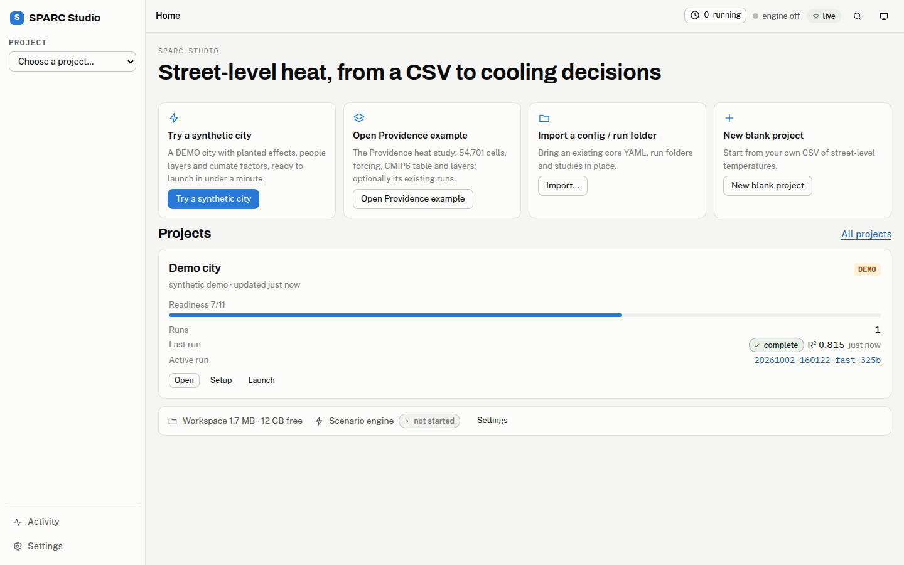

- **Left sidebar.** The project switcher, then the project's pages: Overview · Setup · Inputs · Launch · Runs · **Scenario Lab** · Studies · Exports · Findings. Scenario Lab stays greyed out until the project has a run with a checkpoint. Activity (all jobs) and Settings sit at the bottom.
- **Top bar.** Breadcrumb; the active run chip (mode, R², date) with a run switcher; the **job tray** (running and queued jobs, click to open one); the **engine dot** (scenario engine off / loading / ready / busy); the **connection pill** (live, reconnecting, or polling when live updates are blocked); search, i.e. the **command palette**; and the theme switch (system, light, dark).
- **Command palette** (Ctrl-K or Cmd-K): jump to a project, run, job, layer or scenario, or start an action.

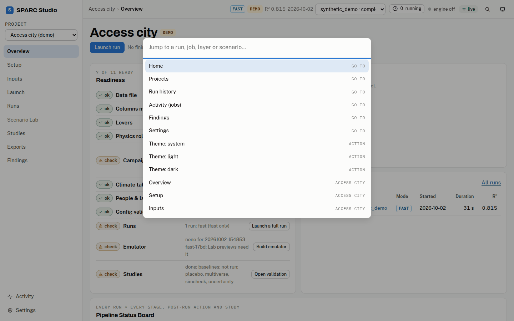

- **Everything is in the URL.** Project, run, tab, map layer, selection, compare items: copy the address and it reopens exactly that view. Reloading a page never loses your place.
- **The browser tab title** follows the most important running job (`▶ 42% S2_S3 · SPARC Studio`).
- **Honest numbers.** Every number carries its unit and sign ("cooler", "warmer"); extrapolated cells are hatched; outputs a run does not have say which stage or study would produce them and offer a button for it; stale files are badged. Projects built on the synthetic city carry a **DEMO** badge on every page.
- **Keyboard.** Every control is reachable with Tab. On a map, the arrow keys move a cell cursor (Shift moves ten cells), Enter pins the cell and a screen reader hears its values.

---

## 4. Walkthroughs

Each walkthrough is one of the ten user journeys Studio was designed around (SPEC §2). The end-to-end tests walk J1, the setup pages of J2, J4, J5, J6 and the plan steps of J7 on every change, and a placebo study (J8) and the Providence example (J10) every night.

### J1 — Ten-minute tour with no data

1. Install and run `sparc studio` ([§1](#1-install-and-launch)).
2. On **Home**, choose **Try a synthetic city**. Studio writes a demo project: a synthetic temperature table with planted cooling effects (`data/city.csv` and its `truth.json`), DEMO people and land-cover layers, a DEMO CMIP6-style climate table and a ready-to-run `config.yml`, all placed at a fictional location (UTM zone 19N, EPSG:32619) so maps have coordinates. This takes about a second.
3. The project **Overview** opens. Its readiness list shows what is ready and what is missing, each row with a one-click remedy. A demo project is ready to launch; campaign forcing shows "check" because the demo uses generic radiation.

   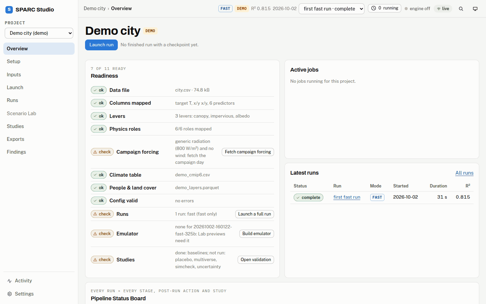

4. Click **Launch first run**. Launch preselects **Fast** and shows, for each mode, the expected time, peak memory and checkpoint size on *this* machine, the stages that will run (S6 "will run" because the demo validates canopy causally) and the plan graph with a time per stage.

   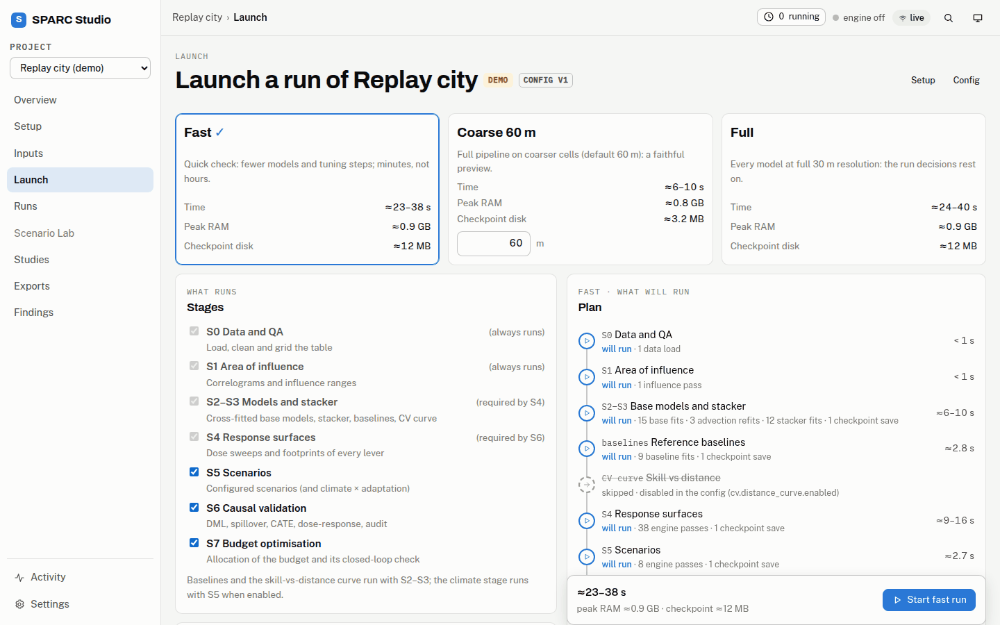

5. **Start fast run** opens **Mission Control**. The stage rail advances, the timeline grows, the fold × model grid fills in, the response curves draw point by point and the scenario feed lists configured scenarios as they finish ([§5](#5-tracking-runs-and-jobs)).

   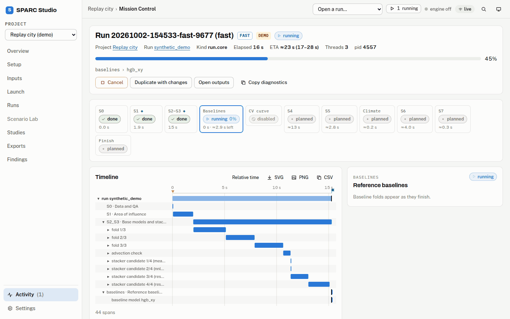

6. You do not have to wait: the run's **Accuracy** tab works as soon as `predictions.parquet` is written, while later stages are still running (the view says it is live).

   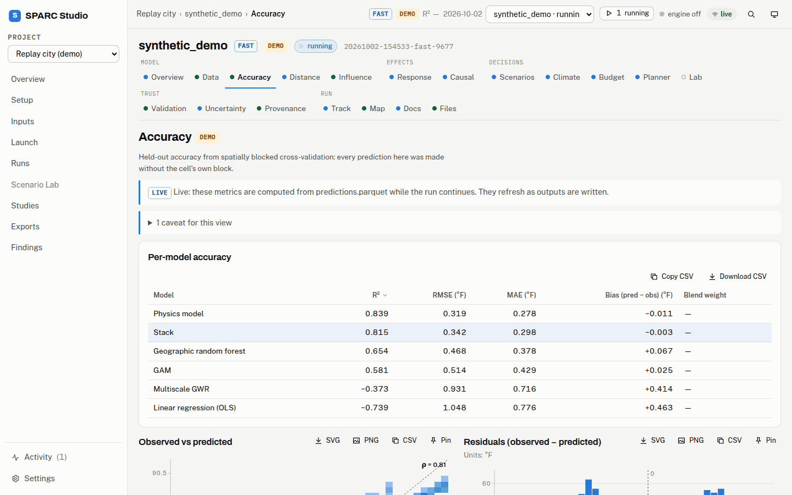

7. When the run succeeds, the overview's primary button becomes **Open Scenario Lab**. In the Lab, start from the template **Shade the hottest 10%**. The preview map appears almost at once.
8. **Run exact**. The engine loads the run (a couple of seconds for a fast run), the folds tick (three on a fast run) and the result card reads in plain language, for example: "Cools the edited area by 0.41 °F (likely range 0.30–0.52 °F). Confident it cools. 12% of the cooling lands outside the edited cells." ([§7](#7-scenario-lab))
9. Open **Validation**. Because the city is synthetic, a **Truth vs recovered** card compares the planted effects with what the run recovered (the fitted effects are typically attenuated to about two-thirds of the truth, and the card says so).
10. Back in the Lab result, export a **Decision pack**; it appears in Exports with a download link ([§6](#6-outputs-and-exports)).

### J2 — A new city from your own CSV

1. Home → **New blank project**, give it a name.
2. **Setup → Data**: drop your CSV or Parquet file. Large files are streamed to the project's `data/` folder. Studio shows a header preview with each column's type, missing values, range and samples, and **suggests a mapping**: target, id, x/y, zone, coordinate unit (feet or metres, from the coordinate range) and a CRS guess. Pick the CRS from the EPSG list or type any EPSG code.
3. **Check data** runs the pipeline's S0 on the spot (about 0.3 s for 55,000 rows): QA flags as badges, grid shape and fill fraction, dropped and clipped counts, background temperature, the rounding-noise floor, and a preview map of any column. You can check unsaved edits; nothing is saved until you save.

   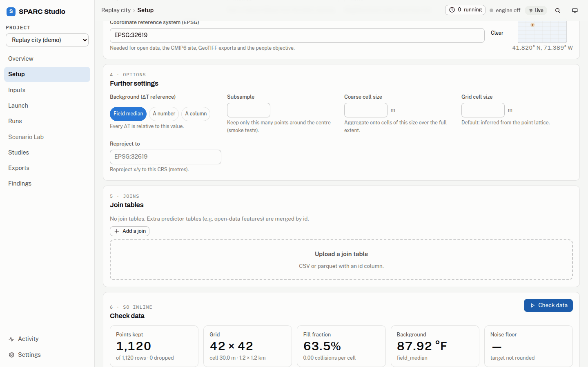

4. **Levers**: choose the predictors, then mark the ones a city can change (canopy, impervious, albedo…) as *actionable*, with bounds, unit, doses, direction and cost. The dose-scale table flags doses beyond one standard deviation of what the city has, because the model would be extrapolating.

   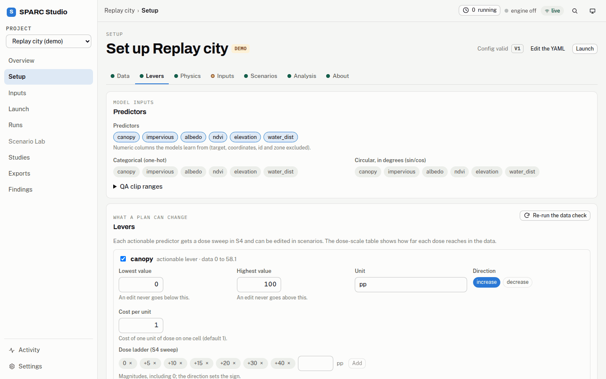

5. **Physics**: map the six physics roles (canopy, impervious, albedo, …) to your columns. A missing canopy or impervious role is flagged with what it disables: placebo tests, the simulation check, the planner and the emulator need them.
6. **Inputs**: four cards, each a tracked download job with its hosts checked first.
   - **Campaign forcing** (ERA5 + the nearest ISD station) for the measurement day. If the station list is not cached yet, **Fetch station list** downloads it (about 3 MB) once.
   - **People & land cover** (HRSL + WorldCover) for exposure and equity.
   - **Open predictors** (Sentinel-2 and elevation) — also usable on a city with no predictors at all ("bootstrap" mode): either as a new `<name>_open` project or as this project's predictors.
   - **CMIP6 change factors** for the climate stage.

   Each card ends with **Link into config**, which shows the YAML change before applying it.

   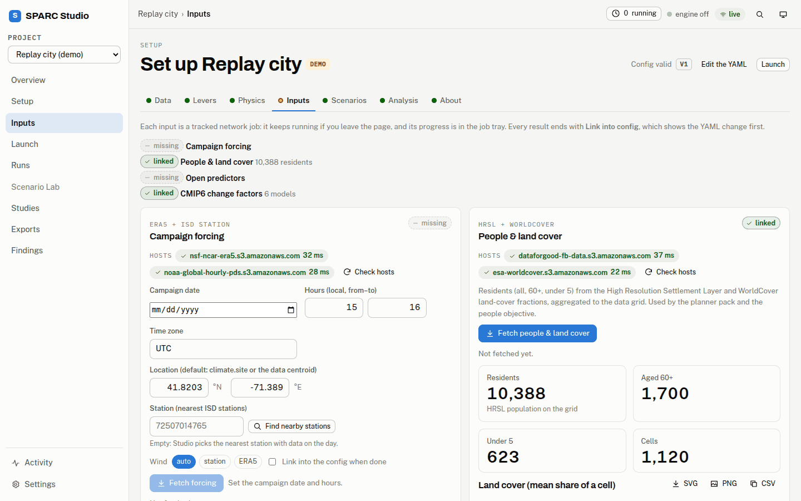

7. **Scenarios**, **Analysis** and **About** set the configured scenario ladders, causal validation, climate, budget optimisation, planner and report details. The config is validated as you go (the "Config valid" chip at the top right); **Edit the YAML** opens the full editor with validation, history and the impact preview.
8. **Launch** a **Coarse 60 m** run first (a faithful preview at a quarter of the cells), then a **Full** run overnight.

### J3 — Overnight full run; the laptop sleeps and the server dies

1. Launch **Full** with the CV curve. Launch shows a time range (e.g. 1 h 40 m – 1 h 55 m), peak memory (≈3 GB) and disk (≈0.6 GB).
2. Close the lid; the server is killed or the machine sleeps.
3. Next morning run `sparc studio` again. The job's process is gone and the run never ended, so the job is **interrupted**. If its last memory sample was above 80% of RAM, the label says "possibly out of memory".
4. The run page shows the **checkpoint card** (Files tab, and the Resume dialog): the stages saved (e.g. S3 and the baselines), when, how big, and whether it still **matches the launch snapshot** (data, code and config; "no: code changed" names what differs). Outputs written before the stop (`predictions.parquet`, `baselines.json`) are already viewable.
5. **Resume** shows the plan: S0 reloads the data (always), S1, S2–S3 and the baselines come from the checkpoint, the rest will run, and how much time that saves.
6. The resumed job's rail marks the reused stages **cached**. Both jobs stay linked to the run.

A resume always uses the run's own launch snapshot (`studio/launch.json`), so editing the project config since then never spoils it. **Resume with current project config** is a separate, explicit choice that refits from the first stage your edits touch, and the dialog shows that impact first.

### J4 — Cancel, adjust, relaunch

1. During S2–S3 the stacker leaderboard and the warnings show something you want to change.
2. **Cancel**. The worker stops at the next safe point (usually within seconds; the model fits check for a cancel between tuning steps) and the job ends **cancelled**. The checkpoint card says what was saved, possibly "none".

   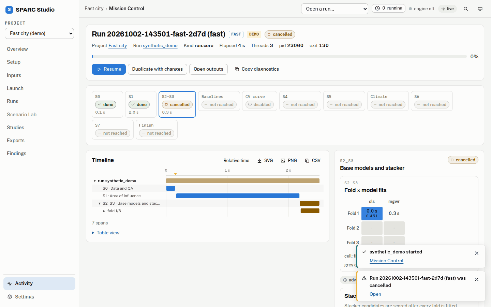

3. Edit the config (Setup, or **Edit the YAML**). The **impact preview** lists, per existing run, which config sections changed and from which stage a re-run would refit ("a re-run with this config would refit from S2_S3"). Existing runs are never affected.
4. Relaunch from Launch, or use **Duplicate with changes** in Mission Control, which opens Launch prefilled from that run.

If you resume a cancelled run instead, the saved stages are reused:

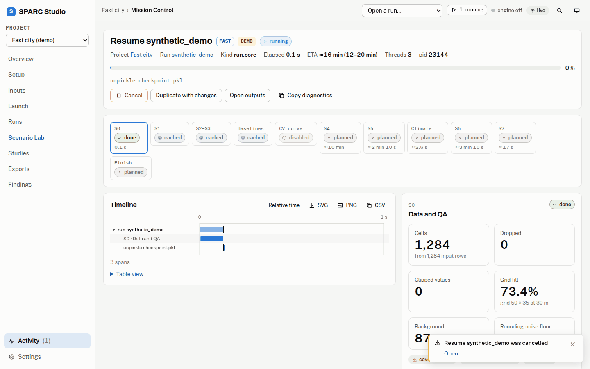

### J5 — Explore every output of a finished run

The **run hub** has one tab per kind of output, grouped Model · Effects · Decisions · Trust · Run. A dot on each tab says ready, partial, running, missing or stale.

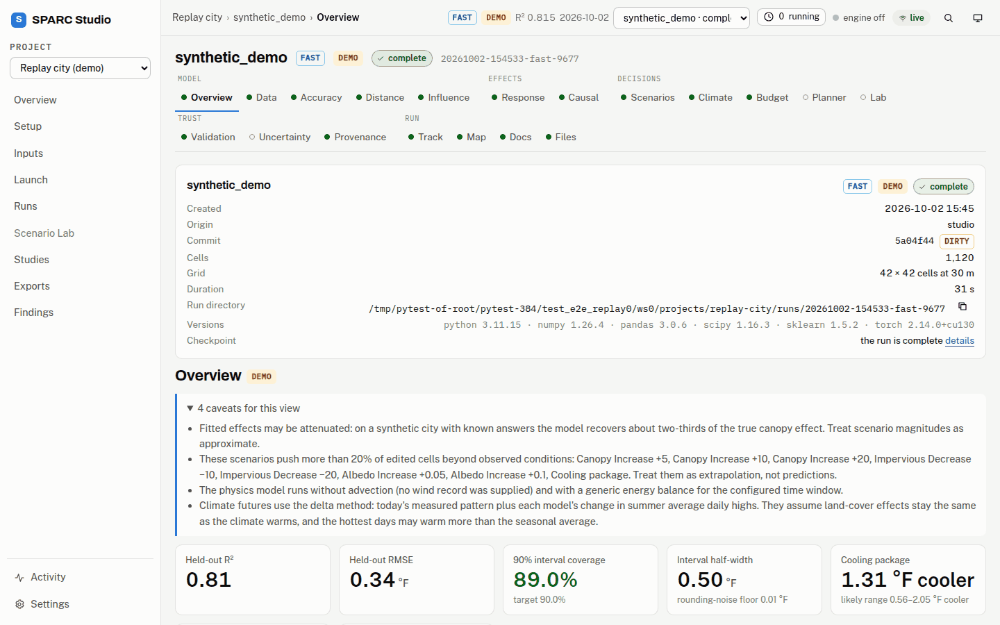

The **Overview** shows the headline numbers (held-out R², RMSE, 90% interval coverage against its target, interval half-width against the noise floor, the headline scenario, mid-century warming), stage timings, data-health flags, the outputs grid with **stale** badges, and eight study chips. Then tour the tabs ([§6](#6-outputs-and-exports)):

- **Map** shows every layer (temperature, inputs, CV design, effects, causal, configured scenarios, budget, planner and people) on a canvas at one pixel per cell, with hexagon views, swipe and side-by-side comparison, and layer export as GeoTIFF, CSV or GeoJSON.

  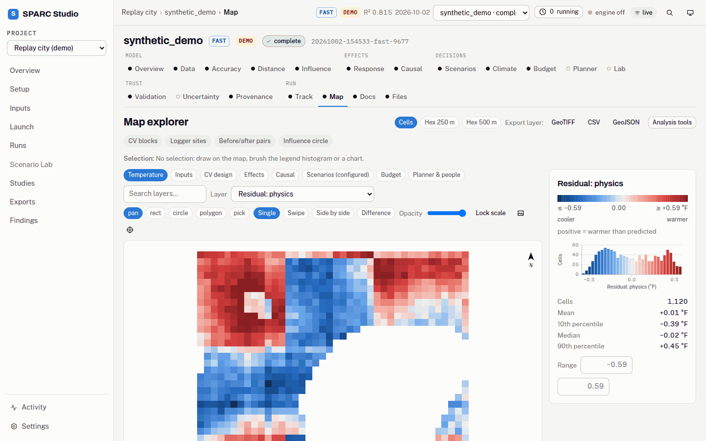

- Brush the far-distance end of the residual histogram: the selection appears on the map, and **Analysis tools → Region stats** summarises it with a jackknife standard error. **Relationships** plots residual against distance to training cells.

  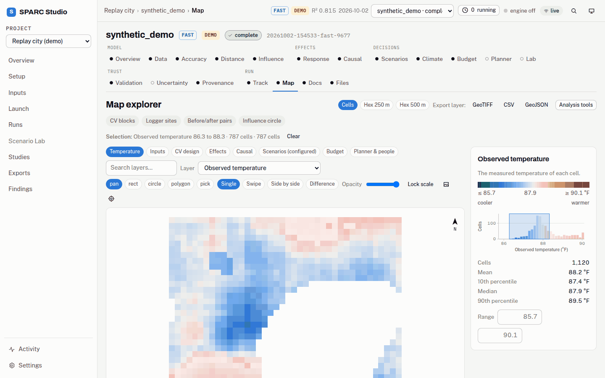

- **Pin to Findings** on any chart keeps the numbers on screen, an image and a note in the project's Findings notebook ([§6](#findings)).
- Export a GeoTIFF of a layer from the map, and a whole-run ZIP from **Exports** (a tracked job; the checkpoint is left out unless you tick it).

### J6 — A district scenario (planner)

1. Open the **Scenario Lab** on the full run. The engine chip shows the checkpoint loading ("Loading checkpoint 312/525 MB…"), then ready, in about 45 s for a full Providence run.
2. Build a selection, e.g. zone 3 **and** `lc_built ≥ 0.5`. The selection chip reads "1,284 cells · 1.16 km² · 6,420 residents · median canopy 12%".
3. Add edits: canopy **fill 50% of plantable headroom**, plus albedo **set 0.35**.
4. The preview carries a trust badge per lever. Albedo is unreliable city-wide in the emulator, but this edit is local, so the preview is not hatched.

   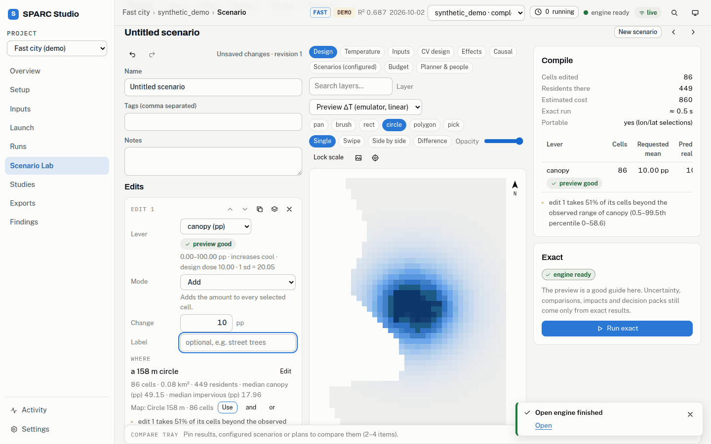

5. **Run exact** (five fold ticks, ≈13 s on a full run). The result shows the edited-area and city means with likely ranges, a ring profile of the cooling that spills outside the edited cells, the share of edited cells outside observed conditions, realised against requested dose, the causal check, residents at or above 90 °F today and in 2041–2060 under SSP2-4.5 with and without the scenario, and the cooling by equity quintile.

   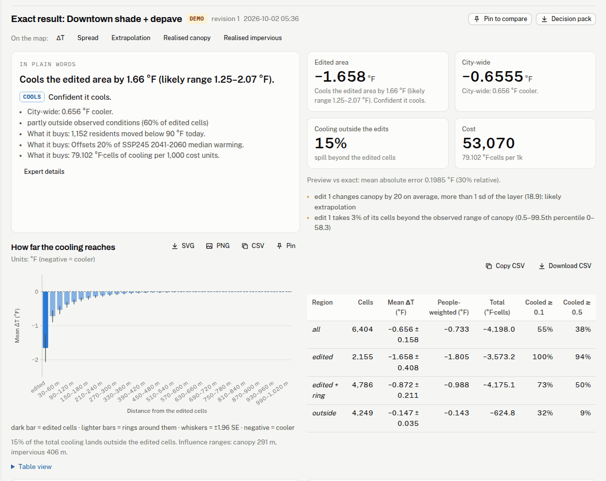

6. Compare it with the configured "Green Infrastructure Package". The paired standard error is available at once, because the run stored the per-fold results of its configured scenarios.
7. Save, fork a variant, and leave the project config alone: this scenario cannot be written as a config ladder, and **Promote to config** says it is not eligible and why.

### J7 — Budget plan to field kit

1. Lab → **Plans**: lever canopy, a budget of 20,000 pp·cells, the plantable cap on, objective "people", equity "share aged 60+" with focus 0.3.
2. The planned allocation and its benefit-versus-budget curve update in under a second as you move the slider. With the "people" objective the residents decide where to plant; the planned benefit and the curve stay the plan's cooling in °F·cells (the caption gives the resident-weighted total apart).
3. **Verify exactly** re-predicts the whole allocation with the engine and reports planned against realised cooling, e.g. "planned 1,704 vs realised 1,037 °F·cells", labelled *spillover non-additivity*: neighbouring treatments overlap, so per-cell responses do not simply add up.

   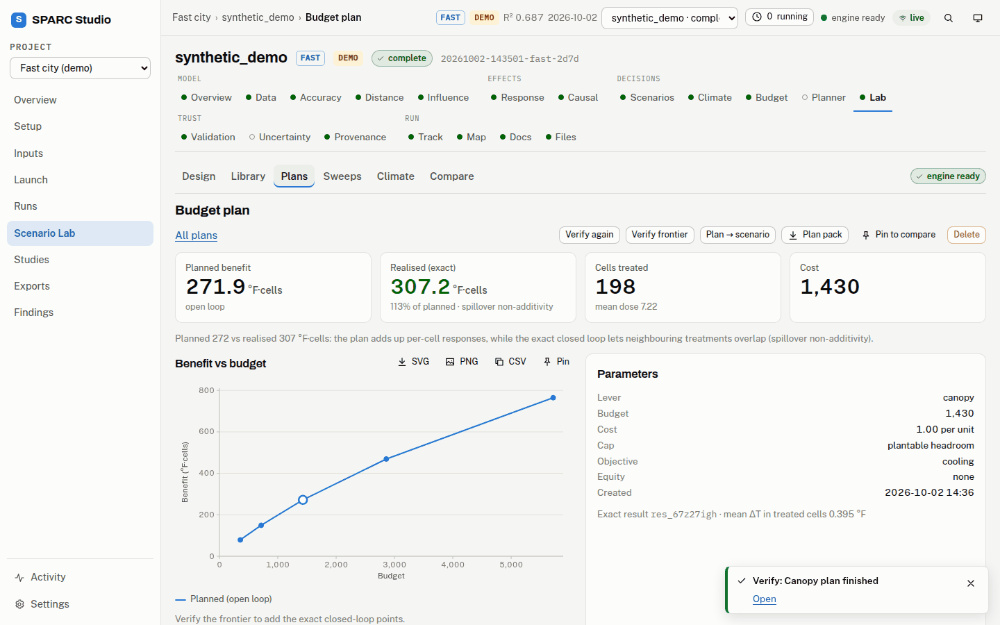

4. **Plan → scenario** puts the plan in the library as a per-cell scenario. **Field kit** lists the cells to treat by rank with longitude and latitude, logger sites and matched before/after pairs for evaluation.
5. Export a **Plan pack**.

### J8 — Validation dossier

The run's **Validation** tab has one card per check, each with its status, estimated cost, launch form and result chart ([§8](#8-studies)). On the full run:

- **Reference baselines** (minutes): does the stack beat simple spatial models?
- **Placebo tests** (three child runs, each with its own mini stage rail): do fake or displaced layers wrongly show an effect?

  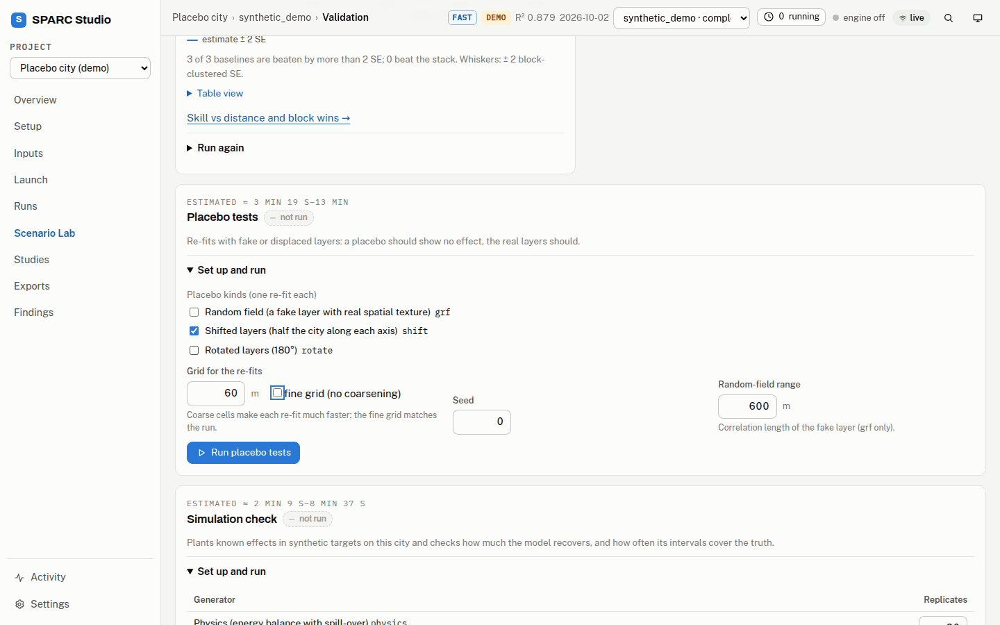

- **Multiverse** (ten variant child runs filling a heatmap): do the conclusions survive reasonable alternative choices?
- **Simulation check** (a generator × seed grid that can be continued across days): how much of a planted effect does the model recover, and do its intervals cover the truth?

When an attached study finishes, the **uncertainty report** is rebuilt automatically, and its envelopes appear on the configured scenarios and on exact Lab results. Finish with **Regenerate methods & model card** (Docs tab).

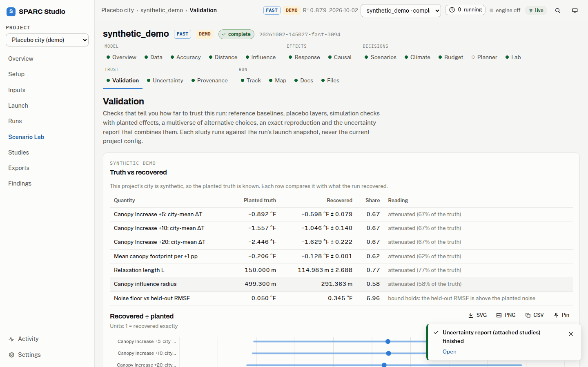

### J9 — Reproduce and compare

1. **Reproduce this run** (Provenance tab, or the Validation card) re-runs the early stages into a child run and produces a checklist: hard checks (CV design, R² per model, scenario effects, input data) and soft ones (code and package versions).
2. **Compare runs** (select two in Runs, or `/p/<project>/compare?a=…&b=…`) shows the config differences, metrics, scenario effects with likely ranges, whether data, config, code and grid are the same, the package differences, stage timings, and for runs on the same grid a difference map and the agreement of their priority maps.

### J10 — Bring existing work in

1. Home → **Open Providence example** copies the bundled Providence inputs (`brown4.csv`, the campaign forcing, the CMIP6 table and the people/land-cover layers) into a new project.
2. From a repository checkout it can also import the recorded runs and studies under `output/core/providence/` **in place**: `providence_uhi`, `providence_uhi_fast`, and the placebo, simulation-check and multiverse folders.
3. Sections the older code did not write show "not in this run (older code)". Files older than the run's manifest (the fast run's Sep-30 `causal.json` and `allocation.parquet`) are badged **stale**.
4. The full run has no recorded config, so Studio reads it with the example config and tells you so.

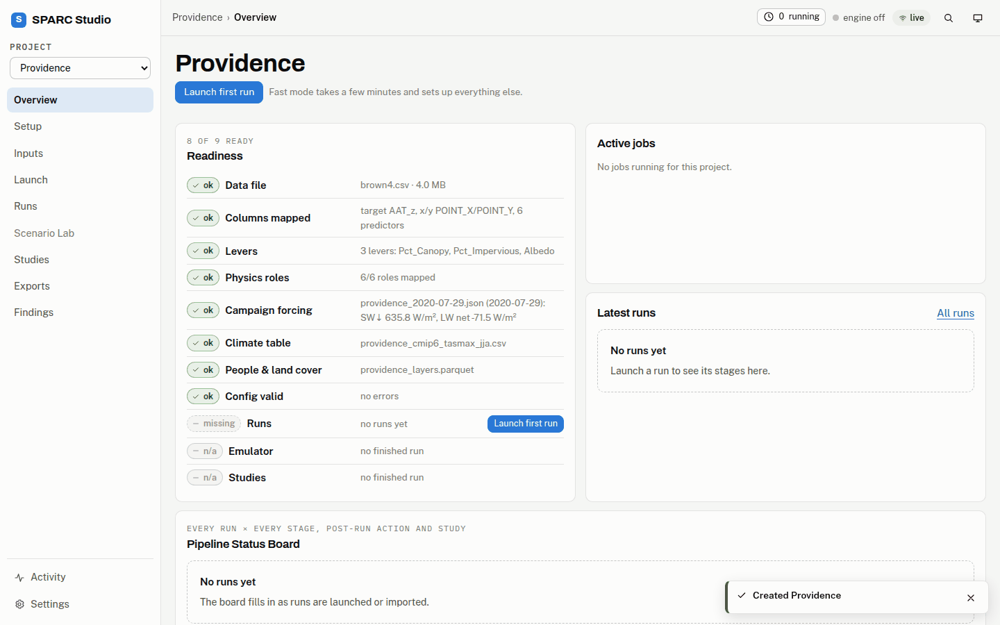

**Import a config / run folder** does the same for your own CLI work: point it at a core YAML config, run folders and study folders. Checkpoint files are Python pickles, which run code when loaded, so imported checkpoints are **untrusted** until you confirm they are your own ("Trust this run's checkpoint?"); until then the Lab refuses to load them, and **Build emulator** is refused too (it loads the checkpoint).

---

## 5. Tracking runs and jobs

Anything slower than about two seconds is a **job**: runs and resumes, post-run actions, studies, input downloads, exports, scenario-engine requests. Each job is a separate process with its own folder (`jobs/<job id>/`), an append-only event log, live updates, a real Cancel and, where the pipeline supports it, Resume. Closing the browser never affects a job.

### Job and stage states

| Job status | Meaning |
|---|---|
| queued / blocked | Waiting for a slot, for a lock on its run, or for the job it follows; *blocked* says why and offers actions |
| starting · running | The worker process is up |
| cancelling | Cancel was requested; the worker stops at the next safe point |
| succeeded · failed · cancelled | Finished |
| interrupted | The process vanished without finishing (server killed, machine slept, out of memory). Runs can be resumed |

Each stage chip on the rail shows its state in words and an icon (never colour alone): **planned → running → done | failed | cancelled | not reached**, or, without running, **skipped** (with the reason), **cached** (from the checkpoint), **disabled** (by the config) or **not requested**. Hover a chip for the reason; click it to open its live panel.

Runs have their own status in the run lists: queued, running, complete, **partial** (stopped with saved stages: always resumable), failed, cancelled, interrupted, live CLI run, or imported.

### Progress and ETA

Progress is **cost-weighted**: each planned unit of work (a model fit in a fold, an engine pass, a causal step…) counts by how long it usually takes, so 50% means half the expected time, not half the stages. The ETA is a **range**: Studio starts from seeded rates, learns from the runs on this machine (per-host medians) and refines the estimate while the run goes. Launch, Resume and the study forms show estimates before you start.

Known limitation: the ETA shown at the start of a **resumed** run does not yet discount the stages that will come from the checkpoint, so it can read much longer than the resume takes; it corrects itself as stages finish.

### Mission Control

Open a job from the job tray, Activity, or a run's **Track** tab (the run's latest job, with a switcher for its earlier ones).

- **Header**: mode badge, status, elapsed time, ETA range, progress bar, the current position (e.g. `cv_curve › 1000 m blocks › fold 4/5 › mgwr › tuning 9/13`), threads and process id. Buttons: **Cancel**, **Force stop** (after the grace period), **Resume**, **Retry**, **Duplicate with changes**, **Open outputs**, **Copy diagnostics** (a JSON blob with the job, its last 200 events and the versions, for bug reports).
- **Stage rail**: eleven chips S0 … finish with durations or estimates and checkpoint markers.
- **Timeline**: the span tree (run › stage › task) with bars growing live, warning ticks and checkpoint flags. Gaps of more than 45 s between heartbeats show as a hatched "system sleep?" band. Export it as SVG, PNG or CSV.
- **Live stage panel**: the QA tiles of S0, the influence ranges of S1, the fold × model heatmap and stacker leaderboard of S2–S3, the baseline forest, the skill-versus-distance curve, the dose–response small multiples of S4, the scenario feed of S5, the causal checklist of S6, planned versus realised of S7.
- **Bottom tabs**: Logs (filter by level, logger, stage and text; download the raw logs), Warnings (grouped with counts, linked to the relevant view), Outputs (each file as it is written, clickable mid-run), Checkpoints, Resources (memory, CPU and processes, with a warning above 80% of memory) and Config & provenance.

Study jobs add a **child matrix** above the tracker: the placebo kinds with their mini rails and verdicts, the multiverse variants, the simulation-check generator × seed grid, the reproduction checklist.

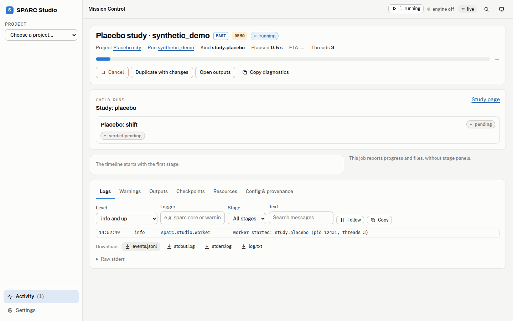

### Cancel, force stop, resume

- **Cancel** asks the worker to stop. It stops at the next safe point (between folds, models, stacker candidates, CV partitions, doses, scenarios, treatments, climate models, replicates and variants, and inside the long model fits), saves nothing half-written and exits; the job ends **cancelled**.
- **Force stop** becomes available 90 s after a cancel. It kills the job's whole process group, pool workers included. Checkpoints and output files are always written atomically, so a force-stopped run is consistent with its last checkpoint.
- **Resume** creates a new job on the same run folder. It reuses the stages saved in the checkpoint as long as the checkpoint matches the launch snapshot; only the number of threads may change. Studies resume at their own granularity: a simulation check skips finished (generator, seed) pairs, a multiverse skips finished variants, a placebo suite resumes per kind.
- **Retry** starts a new job with the same parameters (for a run, that is a resume when a checkpoint exists).

### Interrupted runs and restarts

When the server starts it looks at every job that was running. A job whose process is still alive (same process id *and* start time) is **reattached**: Studio follows it to the end as if nothing happened. Otherwise the job becomes **interrupted** and the run's state is recomputed from its `run_state.json` and `checkpoint.json` (Studio never unpickles a checkpoint just to show this).

Out-of-memory labels:
- a worker killed by the system while its memory was above 80% of what was available ends **failed** with "likely out of memory (peak 11.8 GB of 15.0 GB)";
- an interrupted job whose last memory sample was high says "process vanished; possibly out of memory".

### Activity, Status Board and run history

- **Activity** lists the queue (reorder by priority, pause the queue), running jobs, history with filters, and interrupted jobs with Resume.

  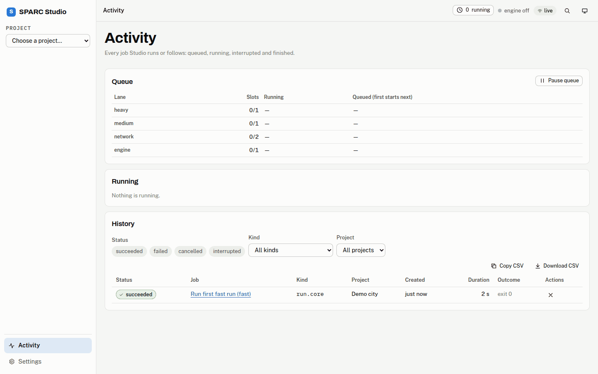

- The **Pipeline Status Board** on the project overview has one row per run and one column per stage, post-run action and study: done (seconds), cached, running (%), failed, skipped (reason), disabled, stale or not run, each with its action. It covers runs made with the CLI too. A post-run job still waiting in a launch's "then run" chain shows as running with "queued".
- **Runs** lists the project's runs (and `/runs` the whole workspace's) with mode, duration, R², RMSE, coverage, checkpoint size, studies and commit; a stage-duration chart across runs, grouped by commit, shows performance changes. Select two to compare.
- **Notifications**: a toast with the headline numbers when a job ends, an optional browser notification (Settings), and the count in the tab title.

### Runs started from the command line

Add the folder that holds your CLI runs to **Settings → Watch roots**. Studio scans it every 10 seconds. A run whose `run_state.json` is fresh shows as a **live CLI run**, with full Mission Control when the run writes progress events:

```bash
sparc core run --project configs/core_providence.yml --fast --progress progress.jsonl
```

(or set `SPARC_PROGRESS=<file>`). Without progress events Studio shows the stage-level state from `run_state.json`. Studio cannot cancel a CLI run; it shows the process id instead.

---

## 6. Outputs and exports

### Run tabs

| Group | Tab | What it shows |
|---|---|---|
| Model | Overview | Header, KPIs, stage timings, data health, outputs grid, study chips, limitations, the run's findings |
| | Data | QA tiles and flags, coverage, dose scale, predictor histograms and correlations, zones, coarse grid, joins |
| | Accuracy | Each model and the stack, observed vs predicted, residuals by zone and fold, interval honesty against the 90% target, stacker, physics, advection, forcing, CV design. Live while the run is going |
| | Distance | Skill against CV block size, reference baselines, which wins |
| | Influence | Influence ranges per predictor, correlograms, rings, anisotropy, priors |
| Effects | Response | Dose–response curves per lever with their shapes and fold means, and the literature comparison |
| | Causal | Per treatment: forest, audit, doubly-robust curve against the model's own curve, CATE maps, sensitivity |
| Decisions | Scenarios | The configured scenarios with likely ranges, ladders, per-fold detail |
| | Climate | Warming by SSP and period, models, exposure, adaptation offset, thresholds |
| | Budget | The S7 allocation: KPIs, Pareto curve, top cells |
| | Planner | Exposure, person-weighted means, hot days, equity, plantable space, zones, hexagons, logger sites and pairs, GIS files |
| | Lab | The Scenario Lab ([§7](#7-scenario-lab)) |
| Trust | Validation | Study cards ([§8](#8-studies)) |
| | Uncertainty | Layered intervals per scenario and the studies they draw on |
| | Provenance | Hashes, git, platform, packages and their differences, effective config, launch snapshot, Reproduce |
| Run | Track | Mission Control for the run's jobs |
| | Map | The map explorer and analysis tools |
| | Docs | Run report, methods, model card, uncertainty, placebo, multiverse, simulation-check and benchmark documents; Regenerate |
| | Files | Every file with its catalogue entry, the data dictionary, previews, raw downloads and conversions, and the checkpoint card |

Every tab opens even mid-run. A missing output names the stage or study that produces it and offers the action ("Resume to compute S6", "Run planner pack"). A stage a finished run skipped offers **Re-run with <stage>**, which opens Launch prefilled from that run. Sections that older code did not write say "not in this run (older code)".

### Findings

**Pin to Findings** (on charts, maps and result cards) stores the view and its full URL state, a title, a Markdown note, the numbers on screen and an optional image. The **Findings** notebook (per project, or `/findings` for all projects) lets you reorder (drag or move buttons), annotate in place, filter by run, open each finding exactly where it was pinned, and export the notebook as a Markdown ZIP with images or a self-contained HTML file. Exports reproduce the snapshotted numbers and carry a provenance block and the caveats.

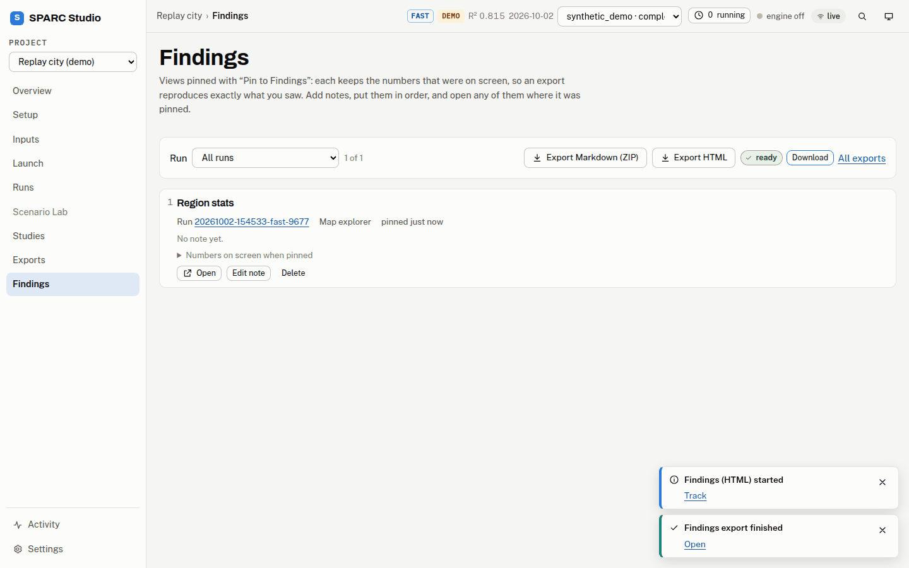

### Exports & reports

The **Exports** page has the report builder, one card per export and the project's export history. Every export is a tracked job that writes into `projects/<slug>/exports/<export id>/`; the history lists them with their status, size, **Download** and **Delete**.

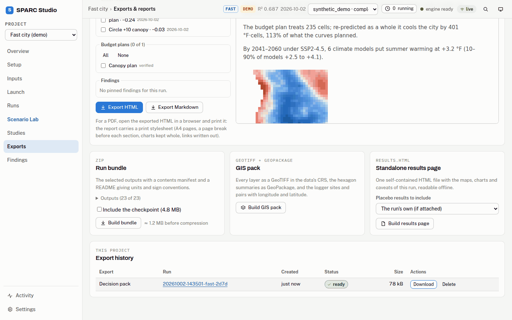

| Export | What you get |
|---|---|
| Any layer (Map, Lab) | GeoTIFF (float32, the data's CRS, NaN for no data), CSV or GeoJSON, straight away |
| Charts and maps | SVG, PNG or CSV from each chart's toolbar |
| Run bundle | A ZIP of the outputs you tick, a contents manifest and a README with units and sign conventions. The checkpoint is excluded unless ticked; links that point outside the run are never followed |
| GIS pack | One ZIP: every layer as GeoTIFF, `hexagons.gpkg` (250 m and 500 m hexagons), logger sites and before/after pairs with longitude and latitude, and a README |
| Standalone results page | One self-contained `results.html` with the run's maps, charts and caveats, readable offline. Optionally includes a placebo study |
| Project report | The report builder: pick sections (summary, accuracy, validation, scenarios, plans, climate, equity, caveats, limitations, provenance, findings) and the results, plans and findings to include, preview it, then export **HTML** (with a print stylesheet: print to PDF from the browser) or **Markdown** (maps embedded) |
| Findings | Markdown ZIP with images, or self-contained HTML |
| Decision pack (Lab result) | `brief.html`, `scenario.json`, `summary.json`, `cells.csv` (id, lon, lat, zone, ΔT, its sd, extrapolation, realised change), `delta.tif` and realised-change GeoTIFFs, hexagon tables, `README.txt` |
| Plan pack | The decision-pack contents plus the field list, logger sites, before/after pairs and the Pareto table |
| Compare pack | Per-item summaries, paired differences, difference GeoTIFFs and a brief |

Packs are built from **exact** results. A pack made from a scenario without an exact result, or from an unverified plan, is stamped **DRAFT**, carries no standard errors and is built from the emulator preview (so it needs the run's emulator); its extrapolation share reads "not computed (preview)". A plan's planned benefit is never used as a ΔT map: each treated cell holds the cooling its dose brings to its whole neighbourhood (°F·cells).

Runs without a CRS cannot produce longitude/latitude, GeoTIFF, GeoPackage or GeoJSON; the buttons say so.

---

## 7. Scenario Lab

The Lab is where planners spend their time. It opens on a run with a checkpoint (the active run, else the latest one) and has six pages: **Design**, **Library**, **Plans**, **Sweeps**, **Climate** and **Compare**.

### The engine

Exact results need the run's fitted models in memory. Studio keeps them in a long-lived **engine** process that holds a few loaded runs (two by default, within a memory budget) and serves one request at a time. The engine chip shows its state: cold, loading (with progress), ready, busy, or **incompatible** (the checkpoint was written by a different version of the pipeline; see [§10](#incompatible-checkpoints-and-stale-results)). Before loading a run Studio checks the memory it needs and, if it does not fit, offers to evict another run or to wait for a job to finish. Loading takes about 2 s for a fast run and 40–60 s for a full run (faster the second time).

### Scenarios, edits and selections

A **scenario** is a named, revisioned list of **edits**. Each edit is a lever, a mode, an amount and **where** it applies:

| Mode | Meaning |
|---|---|
| add · set · scale | Add an amount, set a value, multiply |
| floor · ceiling | Raise cells to at least, or lower them to at most, a value |
| fill headroom | Fill a share of the plantable headroom (needs the people & land-cover layers) |
| to percentile | Bring cells up to a percentile of the city |
| per cell | A value per cell: a brush stroke, an uploaded CSV of `id,lever,change` (or `id,lever,value`) or a budget plan |

**Selections** combine zones, drawn shapes (rectangle, circle, polygon, in longitude/latitude so they travel between runs), filters on any column ("canopy ≤ 40", "top 10% hottest"), hexagons, buffers around another selection, uploaded cells and saved regions, with and / or / minus / not. The selection chip always says how many cells, how much area and how many residents.

Edits outside a lever's bounds are clipped the way the engine clips them (a cell already outside the bounds is never pushed further out). Non-actionable predictors can be edited only in expert mode.

**Templates** start you off: *Cool roofs on built-up cells*, *Shade the hottest X%*, *Fill X% of plantable space*, *Depave the most paved blocks*, *Prioritise by footprint*, *Around sites* (uploaded or typed points) and *Configured package*.

### Preview versus exact

| | Preview | Exact |
|---|---|---|
| What | The linear emulator built from the run | The run's own scenario engine |
| Speed | ≈0.02–0.15 s, live while you edit | ≈2 s (fast run) to ≈13 s (full run) after the engine has loaded |
| Uncertainty | none | likely range from the cross-validation folds |
| Saturation, clipping to observed conditions | no | yes |
| Used for | design and exploration | every number you report, compare or export |

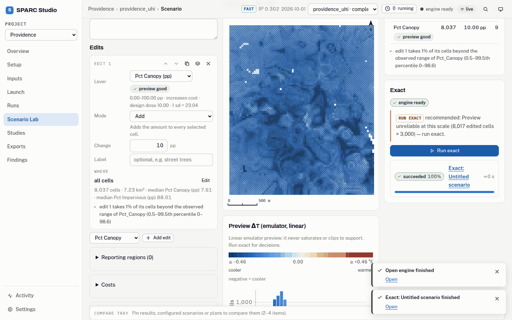

The preview needs the run's **emulator**. If it is missing, the Lab offers **Build emulator** (about a minute for a fast run, 4–5 minutes per lever on a full run); exact results work without it. Each lever carries a **trust badge** from the emulator's own validation: *good*, *rough* or *none*. The preview map is **hatched** with a banner ("Preview unreliable at this scale — run exact") when more than 3,000 cells are edited, a *rough* lever edits more than 1,000 cells, or a city-wide edit uses a lever the emulator gets badly wrong.

### Reading an exact result

The result card speaks plain language by default:

- "**Cools the edited area by 0.62 °F** (likely range 0.44–0.80 °F). City-wide: 0.021 °F cooler."
- **Confident it cools** when the whole 95% range is on the cool side, **Confident it warms** on the warm side, **Could be zero** otherwise.
- Qualifiers when they apply: "partly outside observed conditions (23% of edited cells)", "independent causal check disagrees", "preview only — not verified".
- What it buys: residents moved below a temperature threshold today and mid-century, cooling per unit cost, the share of mid-century warming it offsets.

The **expert** toggle shows the standard errors, the jackknife over folds, cell counts and method notes. Below the card: region breakdowns (edited cells, edited cells plus their influence ring, outside, every zone and saved region), the ring profile of the spill, realised against requested dose per lever (and what mediators like NDVI did), cost, the causal band, the uncertainty envelope from attached studies, and impacts (exposure today and under the climate futures, equity quintiles, hot days avoided when station data is cached).

Results are cached by content: running the same scenario on the same run and checkpoint returns the stored result at once. When the run's checkpoint or the pipeline code changes, old results are marked **stale** but stay readable.

### Library, revisions and promotion

Scenarios autosave every two seconds; undo and redo cover the last 50 steps. Their status moves draft → previewed → exact, and becomes stale when the run or code changes. Changing the edits of a scenario that already has an exact result **forks** a new revision instead, so results are never orphaned; the library shows the lineage tree, tags and the run's configured scenarios (read-only: **Clone to edit**). **Make ladder** forks a series of doses and runs them in one batch. **Promote to config** writes a whole-city scenario into the project config as a configured ladder or package (with a YAML diff first); the current run is never touched.

### Compare and check across runs

**Compare** takes two to four items (exact results, configured scenarios, plans, the baseline): locked-scale maps, the A − B difference map with swipe, a KPI table with **paired** standard errors, regions, equity, exposure, cost and causal bands. Differences always read A − B: a negative value means A cools more. Paired errors use the shared fold models, so they are much tighter than comparing two independent ranges; configured scenarios of older runs offer **Re-run exactly for paired SE**. An unverified plan has no per-cell ΔT: it is compared by its city mean, cost and cooling per cost only, without edited-area, regional, equity, exposure or difference maps, until you verify it.

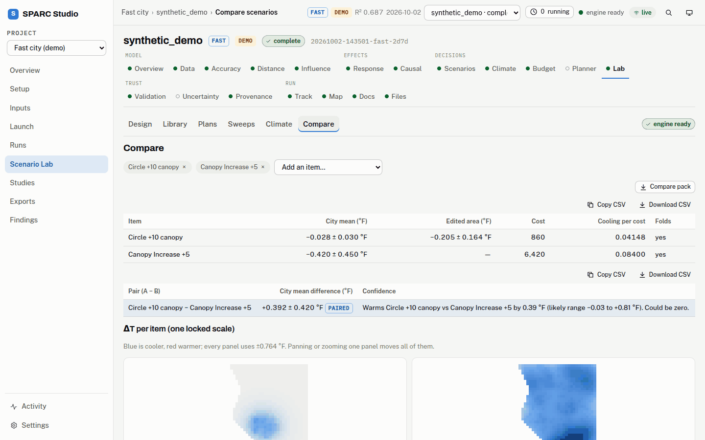

**Check across runs** evaluates the same scenario on other runs of the project (fast, coarse, full, open-data, multiverse children), as one heavy job that shows its time and peak memory before it starts. The spread becomes the specification band of the exact results of the version it checked, including ones computed before the check; a draft edited afterwards needs a new check.

### Sweeps and plans

- **Sweeps** run one lever at a series of doses in a region and fit the saturation curve to the region's benefit against the requested dose (the chart's axis: the overlay, its d90 line and caption), overlaid on the run's response curves. The fit against the neighbourhood dose (the smoothed dose around each cell, smaller for a regional sweep) is quoted in its own units, with each point's neighbourhood dose in the table.
- **Plans** ([J7](#j7--budget-plan-to-field-kit)) optimise a single-lever budget: budget slider, cost (a number or any cost column), caps (plantable headroom, a region), a minimum dose per treated cell (allocations below it are dropped and the freed budget is reported, not re-spent), objective (cooling or people reached) and equity (score source and focus). **Verify exactly** and **Verify frontier** run the allocation through the engine. Combining several single-lever plans in one scenario is allowed and labelled "not jointly optimal".

### Climate × adaptation

**Climate** combines the run's CMIP6 change factors (SSPs, periods, a statistic across models) with today's measured pattern and any adaptation (exact results or configured scenarios): warming by period, exposure above your thresholds, how much of the warming each adaptation offsets, and future-temperature maps that update instantly. Without a climate table it offers **Fetch CMIP6 change factors**.

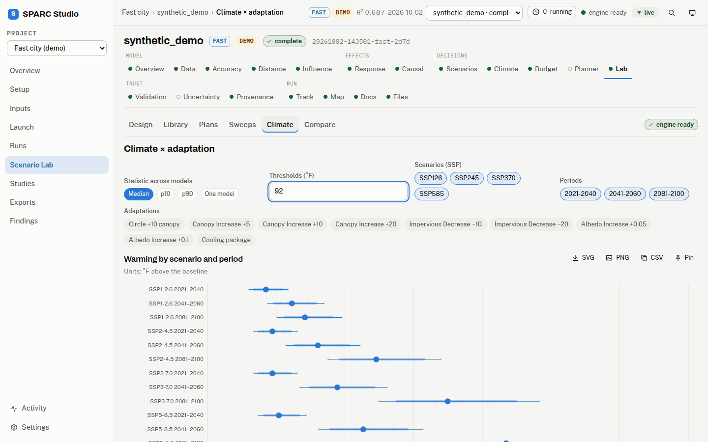

---

## 8. Studies

Studies are the evidence that a run can be trusted. All of them are tracked jobs that use the **run's launch snapshot**, never the current project config, and write either into the run (post-run actions) or into `projects/<slug>/studies/<study id>/` (studies, with their child runs under `children/`).

| Card | Kind | What it does | Needs | Typical cost |
|---|---|---|---|---|
| Reference baselines | action | Scores simple spatial baselines against the stack | predictions | minutes |
| Planner pack | action | Exposure, hot days, equity, plantable space, hexagons, logger sites and pairs, GIS files | `planner.layers` | minutes |
| Scenario emulator | action | Builds the linear emulator for Lab previews | the checkpoint | ≈1 min fast, 4–5 min per lever full |
| Uncertainty report | action | Layered intervals per scenario from the attached studies | — | seconds |
| Methods & model card | action | Regenerates `methods.md` and `model_card.md` from the merged manifest | — | seconds |
| Placebo tests | study | Re-fits with a random field, shifted or rotated layers (one child run each); a placebo should show no effect | canopy/impervious roles | minutes per kind at 60 m |
| Simulation check | study | Plants known effects on this city with several generators × seeds and measures recovery and interval coverage | both roles | long; resumable |
| Multiverse | study | Re-runs alternative modelling choices (built-in and custom variants) and checks that effects and priorities agree | — | one child run per variant |
| Reproduction | study | Re-runs S0–S3 into a child run and checks the results match | a recorded config | like the original stages |
| Effect benchmark | project study | Recovery of known effects on synthetic cities with and without Spatial+ | nothing | minutes |
| Literature | panel | How the run's response rates compare with published ones (from the response stage) | — | — |

Each card shows its status (not run, queued, running, done, **stale vs run**, failed), the estimate, what is missing if it cannot run, its result chart, and **Run again** prefilled from the last parameters. For simulation checks and multiverses, workers × threads must fit the heavy-job thread setting.

- **Attach / Detach** (placebo, simulation check, multiverse): attached studies feed the run's uncertainty report. Studies launched from a run are attached to it automatically. When an attached study finishes, or you attach or detach a finished one, the uncertainty report is rebuilt (Settings → "Rebuild uncertainty envelopes when an attached study finishes").
- **Stale**: a study is stale against a run whose checkpoint has changed since the study ran.
- The **Studies hub** (sidebar) shows a status matrix for every run of the project, the project's studies by kind, and the effect benchmark launcher. Each study has its own page with its result view, its child runs (each linking to its run and tracker), attach/detach, resume (for studies that stopped unfinished), delete, and for simulation checks a **merge** across studies.

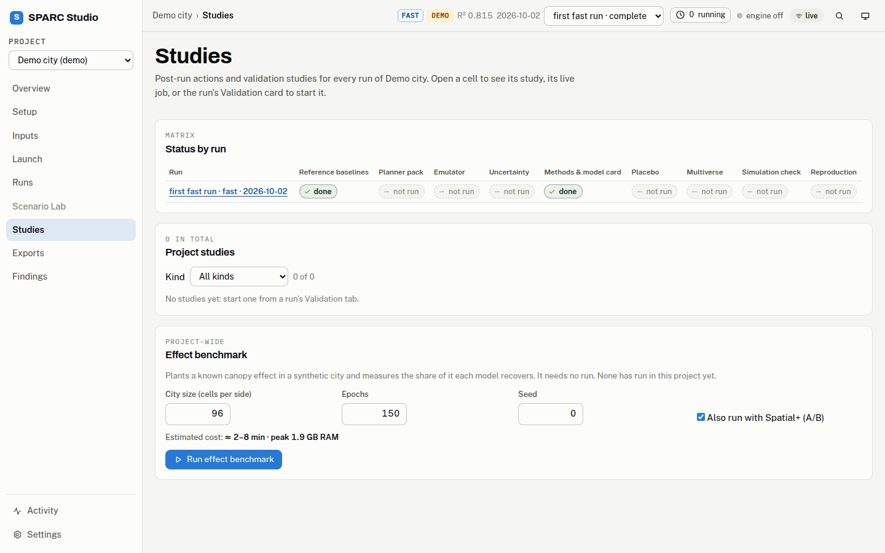

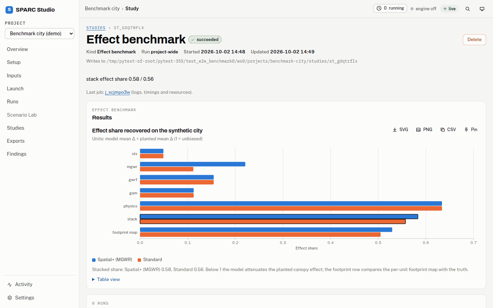

Imported study folders are read-only: they cannot be resumed or continued, and deleting them never deletes their files.

---

## 9. Settings, thread budget and memory

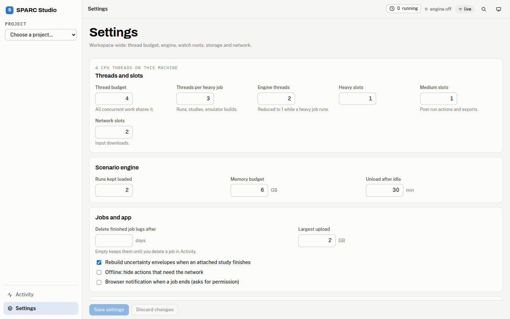

| Setting | Default | Notes |
|---|---|---|
| Thread budget | number of CPU threads | Everything running at once shares it |
| Threads per heavy job | CPU threads − 1 | Runs, studies, emulator builds |
| Engine threads | 2 | Reduced to 1 while a heavy job runs |
| Heavy · medium · network slots | 1 · 1 · 2 | How many jobs of each lane run at once; post-run actions and exports are medium, downloads network |
| Runs kept loaded | 2 | Scenario engine LRU |
| Memory budget | 40% of RAM, at most 6 GB | For loaded engines; above it the least recently used run is unloaded |
| Unload after idle | 30 min | The engine process exits when idle this long |
| Rebuild uncertainty when an attached study finishes | on | |
| Watch roots | none | Folders scanned for CLI runs |
| Largest upload | 2 GB | |
| Delete finished job logs after | never | |
| Offline | off | Hides every action that needs the network |
| Browser notifications | off | |

**Why a thread budget.** Model fits slow down badly when too many threads compete (fits measured at 82–368 s instead of 1 s). Studio therefore gives each worker an explicit thread count and refuses settings where heavy-job threads plus engine threads exceed the budget by more than one. Leave the defaults unless you know the machine is shared.

**Memory.** Launch and the engine check memory before starting: a job or engine load whose estimate plus 1 GB exceeds the memory available (after other live jobs) is refused with options to stop a job or unload a run. The Resources tab of Mission Control warns above 80% of memory. If a run keeps dying out of memory, use **Coarse 60 m**, close other heavy jobs, or lower "Runs kept loaded".

**Storage** (Settings → Storage) shows the workspace size, free disk, caches and per-run and per-study sizes, with guarded deletes. Studio broadcasts a warning when free disk falls below 2 GB.

**Network check** tests the hosts the input downloads need, and caches the answer for ten minutes.

---

## 10. Troubleshooting

### `sparc studio` says SPARC Studio is not available

```text
SPARC Studio is not available (No module named 'fastapi').
Install it with:  pip install "sparc[studio]"
```

Install the extra into the same Python environment as `sparc` (exit status 2 means exactly this).

### The port is busy, or another Studio holds the workspace

A busy port falls back to a free one, and the printed link has the real port. If the terminal says another SPARC Studio process holds the workspace but does not answer, a server for that workspace is still starting (a long `--reindex`) or hung: wait, or stop that process and start again. Studio never starts two servers on one workspace and never kills the other one.

### The browser shows 401, or "Frontend not built"

- **401**: the session cookie is missing or from an earlier launch. Open the link the terminal printed (it carries the new token).
- **"Frontend not built — run `npm --prefix studio-web run build`"**: you are running from a source checkout whose built web app is missing. Rebuild it (see [`DEVELOPING.md`](DEVELOPING.md)) or install a released package.

### A job ended "likely out of memory" or "possibly out of memory"

The worker was killed by the operating system while it used most of the memory. Resume it once other heavy jobs have finished and loaded runs are unloaded (the engine's memory dialog offers to unload them; Settings → Scenario engine → "Runs kept loaded" keeps fewer), or launch **Coarse 60 m**. Simulation checks and multiverses run several child fits at once: lower their workers.

### A run is interrupted

The process vanished (server killed, sleep, out of memory). Open the run: the checkpoint card says what is saved and whether it matches the launch snapshot, and **Resume** reuses it. A run interrupted before its first checkpoint (before S2–S3 finished) has nothing to reuse, so a resume starts again from S0.

### Resume refuses, or would refit everything

- **Resume is refused** in three cases, and the dialog says which: the run has no launch snapshot (it was made with the command line, not launched from Studio: launch a new run of the project from **Launch**), the run is already complete, or a job is still running on it. **Resume with current project config** is also refused for a run that belongs to no project, or when the current project config does not load.
- **"the checkpoint does not match the launch snapshot (… changed): a resume refits"** means the data file or the pipeline code changed since the run was launched; the card names which. A resume still runs, but reuses nothing. If the code changed because you upgraded, see the next item. To refit on purpose with your edited project config, use **Resume with current project config**, which shows its impact first.

### Incompatible checkpoints and stale results

- **Checkpoints from before this release cannot be resumed.** This release changed the pipeline code that a checkpoint's fingerprint covers (see [`RELEASE_NOTES.md`](RELEASE_NOTES.md)). Such runs still open: every output stays viewable and the Lab can still load their checkpoints. They have no `checkpoint.json`, so the engine cannot tell which code wrote them (`code_match: null`).
- **Code changed since a checkpoint was saved**: for checkpoints written by this release, a later change of the pipeline code makes the engine report `code_match: false`; the Lab still loads the checkpoint, a resume refits (see above), and exact results computed before the change are marked **stale**.
- **Engine "incompatible"**: the checkpoint cannot be loaded by this version (a class it pickled no longer exists). The engine chip offers **Refit S2/S3**, which re-runs the run from its launch snapshot as a new run; meanwhile you can work with previews only.
- **Stale results** (a banner on a result) were computed before the run's checkpoint or the pipeline code changed. They stay readable; **Run exact** again to refresh them.
- **Untrusted checkpoint**: an imported run's checkpoint is not loaded until you confirm it is yours ([J10](#j10--bring-existing-work-in)).

### Input downloads fail

- Each input card shows the hosts it needs and their reachability (**Check hosts**). Settings has a network check for all of them.
- Downloads retry on their own (the job shows a `network.retry` warning per retry). A failed download can be retried from Mission Control.
- The ISD station picker never downloads during a request: if the station list is not cached, use **Fetch station list** first.
- Everything downloaded is cached in `<workspace>/cache/` and reused by every project.
- **Offline mode** (Settings) hides every action that needs the network, for air-gapped machines. Runs, the Lab, studies and exports work offline once the inputs are in place.

### The preview says `no_emulator`, or is hatched

The run has no emulator: **Build emulator** (Validation card or the Lab banner). Hatching means the preview is unreliable at that scale: use **Run exact**.

### The index looks wrong

If runs, studies or exports are missing after a crash or after copying a workspace, rebuild the index from the files:

```bash
# runnable
WS="${SPARC_STUDIO_HOME:-$HOME/sparc-studio}"
sparc studio --reindex --no-browser --port 0 --token reindex &
for i in $(seq 1 120); do
  URL=$(python -c 'import json, sys; print(json.load(open(sys.argv[1]))["url"])' "$WS/studio.lock.json" 2>/dev/null) \
    && curl -sf "$URL/api/health" > /dev/null && break
  sleep 1
done
curl -fsS -H "Authorization: Bearer reindex" "$URL/api/projects"; echo
curl -fsS -X POST -H "Authorization: Bearer reindex" -H "Content-Type: application/json" -d '{}' "$URL/api/shutdown"; echo
wait
```

(Or simply `sparc studio --reindex`.) Settings, config history, saved regions and uploaded selection masks are not in the files and are kept only if the database survives.

### Where the logs are

- A job: Mission Control → Logs, or `<workspace>/jobs/<job id>/` (`events.jsonl`, `stdout.log`, `stderr.log`, `result.json`). **Copy diagnostics** collects what a bug report needs.
- The scenario engine: `<workspace>/engine/host.log`.
- The server: the terminal (`--log-level debug` for more).

### Known limitations of this release

- The legacy desktop app (`sparc-desktop/`, the `sparc/server/` API) is unchanged and remains available until Studio reaches parity with it.
- The ETA of a resumed run does not discount cached stages at first ([§5](#progress-and-eta)).
- Brush strokes saved in an earlier session reopen as per-cell edits; they can be removed but not repainted.
- Windows and macOS are not tested in CI.
